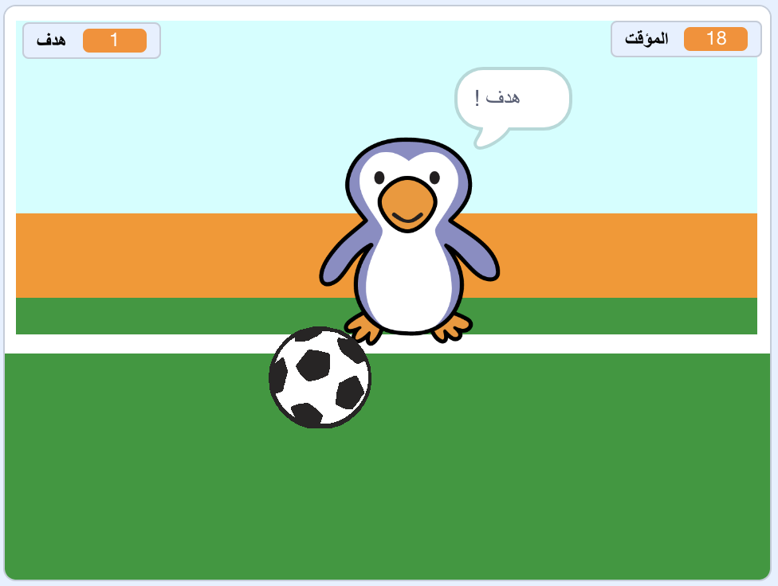

--- no-print ---

هذا هو إصدار **Scratch 3** من المشروع. هناك أيضًا [ إصدار Scratch 2 للمشروع ](https://projects.raspberrypi.org/ar-SA/projects/beat-the-goalie-scratch2).

--- /no-print ---

## المقدمة

في هذا المشروع، سوف تتعلم كيف تنشأ مباراة كرة قدم بين لاعبين أثنين وعليك تسجيل أكبر عدد ممكن من الأهداف خلال 30 ثانية.

### ما الذي سوف تصنعه

--- no-print ---

انقر على العلم الأخضر للبدء. استخدم مفاتيح الأسهم اليمنى واليسرى للتحكم بلاعب حارس المرمى، واضغط على <kbd>مسافة</kbd> لركل الكرة.

  <iframe allowtransparency="true" width="485" height="402" src="https://scratch.mit.edu/projects/embed/390635185/?autostart=false" frameborder="0" scrolling="no"></iframe>

--- /no-print ---

--- print-only ---

--- /print-only ---

--- collapse ---
---
title: ما الذي سوف تتعلمه
---

- تذكر كيفية استخدام الكود البرمجي للرد على الضغط على المفاتيح
- استخدام كتل الاستشعار لكشف متى تلامس الشخصيات بعضها البعض
- كيفية استخدام البث للتواصل بين الشخصيات

--- /collapse ---

--- collapse ---
---
title: ما الذي سوف تحتاجه إليه
---

#### الأجهزة

+ جهاز كمبيوتر يدعم تشغيل برنامج Scratch 3

#### البرمجيات

+ يعمل برنامج Scratch 3 (سواء أكان [عبر الإنترنت](http://rpf.io/scratchon){:target="_blank"} أو [دون اتصال بالإنترنت](http://rpf.io/scratchoff){:target="_blank"})

#### للتحميل

مشغل البرنامج ستجدة [هنا ](http://rpf.io/p/ar-SA/beat-the-goalie-go){:target="_blank"}.

--- /collapse ---

--- collapse ---
---
title: معلومات إضافية للمعلمين
---

--- no-print ---

إذا كنت بحاجة إلى طباعة هذا المشروع ، فالرجاء استخدام الإصدار [الملائم للطابعة](https://projects.raspberrypi.org/ar-SA/projects/beat-the-goalie/print){:target="_blank"}.

--- /no-print ---

يمكنك الحصول على [المشروع كاملاً من هنا](http://rpf.io/p/ar-SA/beat-the-goalie-get){:target="_blank"}.

--- /collapse ---
