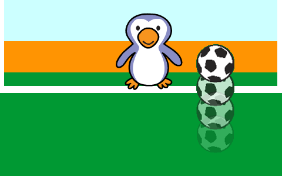

## تحريك كرة القدم

دعونا نقوم ببرمجة الكرة للتحرك عبر أسفل المنصة.

--- task ---

افتح مشروع السكراتش Scratch 'تغلب على حارس المرمى'.

**متصل بالانترنت**: افتح مشروع البدء من هنا [scratch.mit.edu/projects/390636699](https://scratch.mit.edu/projects/390636699){:target="_blank"}.

اذا كنت تملك حساب على منصة السكراتش (Scratch) فيمكنك عمل نسخة بالضغط على **Remix**.

**دون اتصال بالانترنت**: افتح [افتح المشروع](http://rpf.io/p/ar-SA/beat-the-goalie-go){:target="_blank"} عبر المحرر الموجود على جهازك.

اذا تحتاج الى تنزيل وتنصيب برنامج السكراتش Scratch على جهازك الشخصي، ستجده في [rpf.io/scratchoff](http://rpf.io/scratchoff){:target="_blank"}.

في بداية المشروع، من المفترض أن ترى خلفية الهدف مع علامة التصويب (+).


--- /task ---

--- task ---

انقر فوق لاعب كرة القدم. أضف هذا الكود البرمجي، بحيث تتحرك كرة القدم على طول أسفل الشاشة حتى يتم الضغط على المفتاح الطويل في مفاتح الحاسوب.


```blocks3
when green flag clicked
repeat until <key (space v) pressed?>
move (10) steps
if on edge, bounce
end
```

--- /task ---

--- task ---

انقر على العلم الأخضر لأختبار لعبتك. يجب أن ترتد كرة القدم على طول أسفل الشاشة حتى يتم الضغط على المفتاح الطويل في مفاتيح الحاسوب.


--- /task ---

--- task ---

أضف الكود البرمجي إلى لاعب كرة القدم الخاص بك، بحيث تتحرك كرة القدم نحو الهدف بعد الضغط على المفتاح الطويل في مفاتيح الحاسوب.


```blocks3
when green flag clicked
repeat until <key (space v) pressed?>
move (10) steps
if on edge, bounce
end
+ repeat (15)
change y by (10)
end
```

--- /task ---

--- task ---

انقر على العلم الأخضر لأختبار لعبتك. هذه المرة، أضغط على المفتاح الطويل ويجب على الكرة الخاصة بك أن تتحرك نحو الهدف.



--- /task ---

--- task ---

انقر على العلم الأخضر لأختبار اللعبة. ماذا يحدث إذا قمت بالنقر على العلم مرة ثانية؟ هل يمكنك إصلاح هذه المشكلة؟

--- hints ---


--- hint ---

بعد النقر على `العلم الأخضر `{:class="block3events"} `سيكون على اللشخصية `أن يذهب إلى{:class="block3motion"} العودة إلى البداية.

--- /hint ---

--- hint ---

ستحتاج إلى هذه الكتلة:

```blocks3
go to x:(-200) y:(-140)
```

--- /hint ---

--- hint ---

يجب أن يبدو الكود البرمجي خاصتك بالشكل التالي:


```blocks3
when green flag clicked
+ go to x:(-200) y:(-140)
repeat until <key (space v) pressed?>
move (10) steps
if on edge, bounce
end
repeat (15)
change y by (10)
end
```

--- /hint ---

--- /hints ---

--- /task ---

