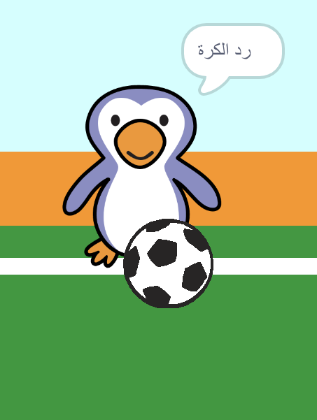

## هل كان هدفًا؟

بمجرد أن تصل الكرة إلى الهدف، هناك قرار لأتخاذه. __ اذا __ لامست الكرة حارس المرمى فقد تم ردها، و __إلا__ فهي هدف.

--- task ---

أضف هذا الكود البرمجي إلى نهاية كود لاعب كرة القدم، حتى تتمكن من التحقق مما إذا كانت الكرة حارس المرمى.


```blocks3
repeat (15)
change y by (10)
end
+if <touching (goalie v)> then
else
end
```

--- /task ---

--- task ---

`ابدأ صوت 'المعركة' `{:class="block3sound"} `إذا كان حارس المرمى قد رد الكرة `{:class="block3control"}.


```blocks3
if <touching (goalie v)> then
+start sound (rattle v)
else
end
```

--- /task ---

--- task ---

يمكنك أيضا أرسال رسالة إلى حارس المرمى، بحيث يمكنه إخبارك بأن الكرة قد تم ردها.

أرسل رسالة 'رد' عند رد الكرة.


```blocks3
if <touching (goalie v)> then
start sound (rattle v)
+broadcast (save v)
else
end
```

--- /task ---

--- task ---

يمكنك الآن برمجة الكود الخاص بك لقول 'رد الكرة!' لحارس المرمى عندما يتلقى الرسالة.


```blocks3
when I receive [save v]
say [Save!] for (1) seconds
```

--- /task ---

--- task ---

أختبر الكود البرمجي الخاصة بك لمحاولة تسجيل الهدف. إذا رد حارس المرمى الكرة فيجب أن يقولوا 'رد الكرة!'.



--- /task ---
