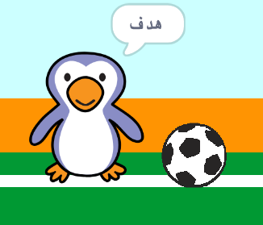

## هدف!

--- task ---

هل يمكنك تشغيل الصوت وبرمجة حارس المرمى ليقول 'رد الهدف!' عندما يتم تسجيل الهدف؟

تذكر أن الهدف قد تم إحرازه إذا كانت الكرة لا تلامس حارس المرمى.



--- hints ---

--- hint ---

`إذا لم تكن كرة القدم `{:class="block3control"} ` تلامس حارس المرمى`{:class="block3sensing"} يجب على برنامجك `بدء صوت التشجيع `{:class="block3sound"} و `بث رسالة هدف`{:class="block3events"}.

`عندما يتلقى حارس المرمى رسالة الهدف `{:class="block3events"} ينبغي أن `يقول هدف`{:class="block3looks"}.

--- /hint ---

--- hint ---

ستحتاج إلى هذه الكتل:

```blocks3
broadcast (goal v)

say [Goal!] for (1) seconds

when I receive [goal v]

start sound (cheer v)
```

--- /hint ---

--- hint ---

يجب أن تبدو الكود البرمجي الخاص بك بالشكل التالي:


```blocks3
if <touching (goalie v)> then
start sound (rattle v)
broadcast (save v)
else
+ start sound (cheer v)
+ broadcast (goal v)
end
```


```blocks3
when I receive [goal v]
say [Goal!] for (1) seconds
```

--- /hint ---


--- /hints ---


--- /task ---
