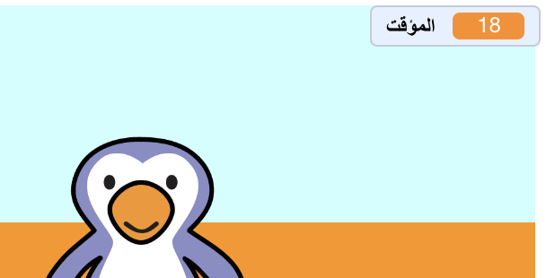

## إضافة مؤقت

دعونا نضيف مؤقتاً، حتى يتمكن اللاعب من تسجيل أكبر عدد ممكن من الأهداف في 30 ثانية.

--- task ---

`اصنع متغير جديد`{:class="block3variables"} يسمى `مؤقت`{:class="block3variables"}.

[[[generic-scratch3-add-variable]]]

--- /task ---

--- task ---

انقر فوق __المنصة__ الخاصة بك، وأضف هذا الكود البرمجي لتعيين `المؤقت `{:class="block3variables"} إلى 30 في بداية اللعبة.


```blocks3
when green flag clicked
set [timer v] to [30]
```

--- /task ---

--- task ---

بعد ذلك، ستحتاج إلى إضافة كتلة `كرر حتى`{:class="block3control"}، حتى يمكن تشغيل المؤقت حتى يصل إلى 0.


```blocks3
when green flag clicked
set [timer v] to [30]
+repeat until <(timer :: variables) = [0]>
end
```

--- /task ---

--- task ---

تقليل المؤقت الخاص بك بمقدار 1 في كل ثانية حتى يصل إلى 0.


```blocks3
when green flag clicked
set [timer v] to [30]
repeat until <(timer :: variables) = [0]>
+wait (1) seconds
+change [timer v] by (-1)
end
```

--- /task ---

--- task ---

بمجرد وصول المؤقت إلى 0، يجب عليك `تشغيل صوت 'المصفرة'`{:class="block3sound"} ثم إيقاف اللعبة.


```blocks3
when green flag clicked
set [timer v] to [30]
repeat until <(timer :: variables) = [0]>
wait (1) seconds
change [timer v] by (-1)
end
+play sound (whistle v) until done
+stop [all v]
```

--- /task ---

--- task ---

انقر على العلم الأخضر لأختبار اللعبة. يجب أن يبدأ المؤقت الساعة من 30 وينتهي عند 0.



يمكنك تغيير المؤقت ليبدأ عند 10 إذا كنت لا تريد الانتظار لمدة 30 ثانية!

--- /task ---

--- task ---

لديك الفرصة فقط لتسجيل هدف واحد! للحصول على أكثر من فرصة واحدة، أضف كتلة `للأبد`{:class="block3control"} حول كود __كرة القدم__ الخاص بك. يمكنك أيضًا إضافة كتلة ` انتظر` {: class = "block3control"} بين المحاولات.


```blocks3
when green flag clicked
+forever
    go to x:(-200) y:(-140)
    repeat until <key (space v) pressed?>
        move (10) steps
        if on edge, bounce
    end
    repeat (15)
        change y by (10)
    end
    if <touching (goalie v)> then
        start sound (rattle v)
        broadcast (save v)
    else
        start sound (cheer v)
        broadcast (goal v)
    end
end
```

--- /task ---

