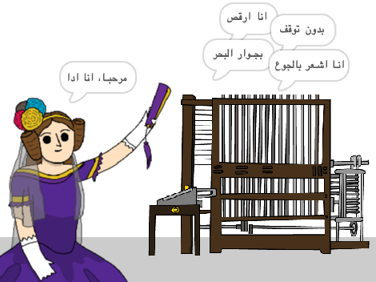

## ما التالي؟

ألقي نظرة على مشروع [مولد شعر آدا ](https://projects.raspberrypi.org/ar-SA/projects/poetry-generator) في سكراتش (Scratch).

--- no-print ---

  <iframe allowtransparency="true" width="485" height="402" src="https://scratch.mit.edu/projects/embed/77844926/?autostart=false" frameborder="0" scrolling="no"></iframe>
  

--- /no-print ---

--- print-only ---

--- /print-only ---

***
تمت ترجمة هذا المشروع بواسطة متطوعين:

بسمة هيثم

نادية علي قاسم

بفضل المتطوعين ، يمكننا إعطاء الناس في جميع أنحاء العالم فرصة للتعلم بلغتهم الخاصة. يمكنك مساعدتنا في الوصول إلى المزيد من الأشخاص من خلال التطوع للترجمة - مزيد من المعلومات على [rpf.io/translate](https://rpf.io/translate).