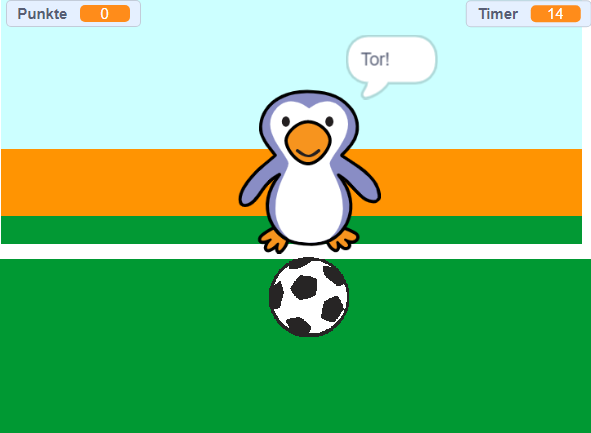

--- no-print ---

Dies ist die **Scratch 3** Version des Projekts. Es gibt auch eine [Scratch 2 Version des Projekts](https://projects.raspberrypi.org/en/projects/beat-the-goalie-scratch2).

--- /no-print ---

## Einleitung

In diesem Projekt lernst du, wie du ein Fußballspiel für 2 Spieler erstellst, bei dem du in 30 Sekunden so viele Tore wie möglich erzielen musst.

### Was du machen wirst

--- no-print ---

Klicke auf die grüne Flagge, um zu beginnen. Verwende die linke und rechte Pfeiltaste, um den Torwart zu steuern, und drücke die <kbd>Leertaste</kbd>, um den Ball zu treten.

  <iframe allowtransparency="true" width="485" height="402" src="https://scratch.mit.edu/projects/embed/285942132/?autostart=false" frameborder="0" scrolling="no"></iframe>

--- /no-print ---

--- print-only ---

--- /print-only ---

--- collapse ---
---
title: Was du lernen wirst
---

- Erinnere dich, wie du den Code benutzt, um auf Tastendrücke zu reagieren
- Wie du Fühlen-Blöcke verwendest, um zu erkennen, wenn sich die Sprites berühren
- Wie du Blöcke zum Senden von Nachrichten verwendest, um zwischen Sprites zu kommunizieren

--- /collapse ---

--- collapse ---
---
title: Was du brauchen wirst
---

#### Hardware

+ Ein Computer, auf dem Scratch 3 ausgeführt werden kann

#### Software

+ Scratch 3 (entweder [online](http://rpf.io/scratchon){:target="_blank"} oder [offline](http://rpf.io/scratchoff){:target="_blank"})

#### Downloads

Das Start-Projekt findest du [hier](http://rpf.io/p/en/beat-the-goalie-go){:target="_blank"}.

--- /collapse ---

--- collapse ---
---
title: Zusätzliche Informationen für Pädagogen
---

--- no-print ---

Wenn du dieses Projekt ausdrucken möchtest, verwende die [druckerfreundliche Version](https://projects.raspberrypi.org/en/projects/beat-the-goalie/print){:target="_blank"}.

--- /no-print ---

Du findest das [fertige Projekt hier](http://rpf.io/p/en/beat-the-goalie-get){:target="_blank"}.

--- /collapse ---
