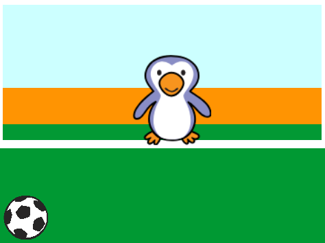

## Den Fußball bewegen

Lass uns den Ball so kodieren, dass er sich über den unteren Rand der Bühne bewegt.

--- task ---

Öffne das Scratch-Starterprojekt 'Schlag den Torwart'.

**Online**: Öffne das Basisprojekt [rpf.io/beat-the-goalie-on](http://rpf.io/beat-the-goalie-on){:target="_blank"}.

Wenn du bereits einen Scratch-Account besitzt, kannst du dir durch Klick auf **Remix** eine Kopie anlegen.

**Offline**: Öffne das [Starter-Projekt](http://rpf.io/p/de-DE/beat-the-goalie-go){:target="_blank"} im Offline-Editor.

Wenn du Scratch herunterladen und auf deinem Rechner installieren möchtest, dann findest du die Datei unter diesem Link: [rpf.io/scratchoff](http://rpf.io/scratchoff){:target="_blank"}.

Im Starterprojekt sollten du einen Torhintergrund, eine Fußball- und eine Torwart-Figur sehen.



--- /task ---

--- task ---

Klicke auf dein Fußball-Sprite. Füge diesen Code hinzu, sodass sich der Fußball am unteren Bildschirmrand bewegt, bis die Leertaste gedrückt wird.


```blocks3
when green flag clicked
repeat until <key (space v) pressed?>
move (10) steps
if on edge, bounce
end
```

--- /task ---

--- task ---

Klicke auf die grüne Flagge, um dein Projekt zu testen. Dein Fußball sollte am unteren Bildschirmrand springen, bis die Leertaste gedrückt wird.


--- /task ---

--- task ---

Füge diesen Code zu deiner Fußball-Sprite hinzu, damit sich der Fußball nach dem Drücken der Leertaste auf das Tor zubewegt.


```blocks3
when green flag clicked
repeat until <key (space v) pressed?>
move (10) steps
if on edge, bounce
end
+ repeat (15)
change y by (10)
end
```

--- /task ---

--- task ---

Klicke auf die grüne Flagge, um dein Spiel zu testen. Drücke diesmal die Leertaste und dein Fußball sollte sich in Richtung Ziel bewegen.


--- /task ---

--- task ---

Klicke auf die grüne Flagge, um dein Spiel zu testen. Was passiert, wenn du ein zweites Mal auf die Flagge klickst? Kannst du das Problem beheben?

--- hints ---


--- hint ---

Nach dem `Wenn die Flagge angeklickt wird`{:class="block3events"}, muss der Sprite durch `gehe zu`{:class="block3motion"} zurück zum Start gehen.

--- /hint ---

--- hint ---

Du benötigst diesen Block:

```blocks3
go to x:(-200) y:(-140)
```

--- /hint ---

--- hint ---

Dein Code sollte so aussehen:


```blocks3
when green flag clicked
+ go to x:(-200) y:(-140)
repeat until <key (space v) pressed?>
move (10) steps
if on edge, bounce
end
repeat (15)
change y by (10)
end
```

--- /hint ---

--- /hints ---

--- /task ---

