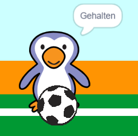

## War das ein Tor?

Sobald der Ball das Tor erreicht hat, muss eine Entscheidung getroffen werden. __falls__ der Ball den Torwart berührt, wurde er gehalten, __sonst__ ist es ein Tor.

--- task ---

Füge diesen Code am Ende deines Fußball-Sprite-Codes hinzu, damit du überprüfen kannst, ob der Ball den Torwart berührt hat.


```blocks3
repeat (15)
change y by (10)
end
+if <touching (Torwart v)> then
else
end
```

--- /task ---

--- task ---

`spiele Klang 'rattle'`{:class="block3sound"} `Falls dein Torwart den Ball hält`{:class="block3control"}.


```blocks3
if <touching (Torwart v)> then
+start sound (rattle v)
else
end
```

--- /task ---

--- task ---

Du kannst dem Torwart auch eine Nachricht senden, damit er Dir mitteilt, dass der Ball gehalten wurde.

Sende eine Nachricht "Gehalten", wenn der Ball gehalten wurde.


```blocks3
if <touching (Torwart v)> then
start sound (rattle v)
+broadcast (Gehalten v)
else
end
```

--- /task ---

--- task ---

Du kannst deinen Torwart jetzt programmieren "Gehalten!" zu sagen, wenn er die Nachricht erhält.


```blocks3
when I receive [Gehalten v]
say [Gehalten!] for (1) seconds
```

--- /task ---

--- task ---

Teste deinen Code, indem du versuchst, ein Tor zu erzielen. Wenn dein Torwart den Ball gehalten hat, sollte er "Gehalten!" sagen.



--- /task ---
