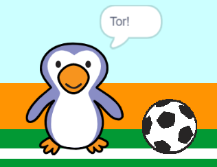

## Tor!

--- task ---

Kannst du einen Klang abspielen lasen und deinen Torwart so kodieren, dass er "Tor!" ruft wenn ein Tor erzielt wurde?

Denke daran, dass ein Tor erzielt wurde, wenn der Ball den Torwart nicht berührt.



--- hints ---

--- hint ---

Wenn dein Fußball den Torwart nicht berührt (`falls wird Torwart berührt?, dann`{:class="block3control"} `sonst`), sollte dein Programm `spiele Klang cheer</0{:class="block3sound"} (Jubel) starten und eine <code>sende Tor an alle</0{:class="block3events"} Nachricht versenden.</p>

<p spaces-before="0">Wenn der Torwart die Tor Nachricht empfängt (<code>wenn ich Tor empfange`{:class="block3events"}), soll er `sage Tor!`{:class="block3looks"} rufen.

--- /hint ---

--- hint ---

Du wirst diese Blöcke benötigen:

```blocks3
broadcast (goal v)

say [Goal!] for (1) seconds

when I receive [goal v]

start sound (cheer v)
```

--- /hint ---

--- hint ---

Dein Code sollte so aussehen:


```blocks3
if <touching (goalie v)> then
start sound (rattle v)
broadcast (save v)
else
+ start sound (cheer v)
+ broadcast (goal v)
end
```


```blocks3
when I receive [goal v]
say [Goal!] for (1) seconds
```

--- /hint ---


--- /hints ---


--- /task ---
