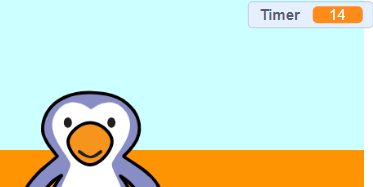

## Hinzufügen eines Timers

Lass uns einen Timer hinzufügen, damit der Spieler in 30 Sekunden so viele Tore wie möglich erzielen muss.

--- task ---

Erstelle eine `Neue Variable`{:class="block3variables"} mit dem Namen `Timer`{:class="block3variables"}.

[[[generic-scratch3-add-variable]]]

--- /task ---

--- task ---

Klicke auf dein __Bühnenbild__und füge diesen Code hinzu, um den `Timer`{:class = "block3variables"} zu Beginn des Spiels auf 30 zu setzen.


```blocks3
when green flag clicked
set [timer v] to [30]
```

--- /task ---

--- task ---

Als nächstes musst du einen `wiederhole bis`{:class="block3control"}-Block hinzufügen, damit der Timer ausgeführt werden kann, bis er abgelaufen ist.


```blocks3
when green flag clicked
set [timer v] to [30]
+repeat until <(timer :: variables) = [0]>
end
```

--- /task ---

--- task ---

Reduziere deinen Timer jede Sekunde um 1, bis er 0 erreicht.


```blocks3
when green flag clicked
set [timer v] to [30]
repeat until <(timer :: variables) = [0]>
+wait (1) seconds
+change [timer v] by (-1)
end
```

--- /task ---

--- task ---

Sobald der Timer 0 erreicht hat, wird ein Pfeifton abgespielt (`spiele Klang whistle ganz`{:class="block3sound"} und das Spiel beendet.


```blocks3
when green flag clicked
set [timer v] to [30]
repeat until <(timer :: variables) = [0]>
wait (1) seconds
change [timer v] by (-1)
end
+play sound (whistle v) until done
+stop [all v]
```

--- /task ---

--- task ---

Klicke auf die grüne Flagge, um dein Spiel zu testen. Dein Timer sollte bei 30 beginnen und bei 0 enden.



Du kannst deinen Timer so ändern, dass er bei 10 beginnt, wenn du nicht 30 Sekunden warten möchten!

--- /task ---

--- task ---

Du hast nur die Chance, 1 Tor zu erzielen! Um mehr als eine Chance zu haben, füge einen `wiederhole fortlaufend`{:class="block3control"}-Block zu deinen __Fußball__-Code hinzu. Du kannst zwischen den Versuchen auch einen `warte`{:class="block3control"}-Block hinzufügen.


```blocks3
when green flag clicked
+forever
    go to x:(-200) y:(-140)
    repeat until <key (space v) pressed?>
        move (10) steps
        if on edge, bounce
    end
    repeat (15)
        change y by (10)
    end
    if <touching (goalie v)> then
        start sound (rattle v)
        broadcast (save v)
    else
        start sound (cheer v)
        broadcast (goal v)
    end
end
```

--- /task ---

