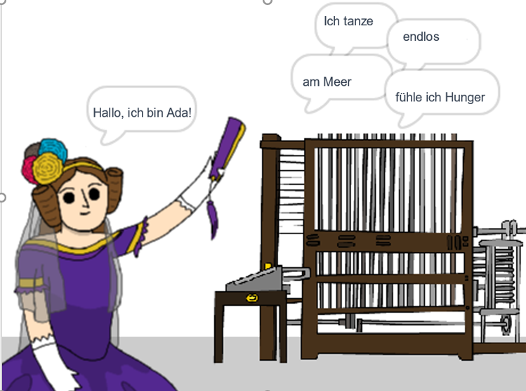

## Was kommt als Nächstes?

Schaue Dir das Scratch-Projekt [Ada's Poesie-Ersteller](https://projects.raspberrypi.org/de-DE/projects/poetry-generator)an.

--- no-print ---

  <iframe allowtransparency="true" width="485" height="402" src="https://scratch.mit.edu/projects/embed/382840859/?autostart=false" frameborder="0" scrolling="no"></iframe>
  

--- /no-print ---

--- print-only ---

--- /print-only ---

***
Dieses Projekt wurde von freiwilligen Helfern übersetzt:

Dennis Weber

Thomas Beul

Dank freiwilliger Helfer können wir Menschen auf der ganzen Welt die Möglichkeit geben, in ihrer eigenen Sprache zu lernen. Du kannst uns helfen, mehr Menschen zu erreichen, indem Du dich freiwillig zum Übersetzen meldest - weitere Informationen unter [rpf.io/translate](https://rpf.io/translate).