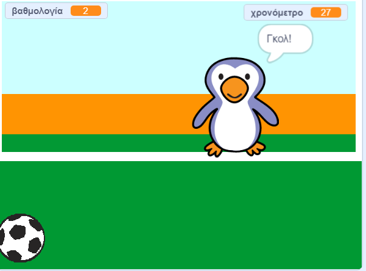

--- no-print ---

Αυτή είναι η **Scratch 3** έκδοση του έργου. Υπάρχει επίσης η [έκδοση Scratch 2 του έργου](https://projects.raspberrypi.org/el-GR/projects/beat-the-goalie-scratch2).

--- /no-print ---

## Εισαγωγή

Σε αυτό το έργο θα δημιουργήσεις ένα ποδοσφαιρικό παιχνίδι 2 παικτών, στο οποίο πρέπει να πετύχεις όσα περισσότερα γκολ μπορείς σε 30 δευτερόλεπτα.

### Τι θα φτιάξεις

--- no-print ---

Κάνε κλικ στην πράσινη σημαία για να ξεκινήσεις. Χρησιμοποίησε το αριστερό και δεξί βέλος για να ελέγξεις τον τερματοφύλακα και πάτησε <kbd>διάστημα (space)</kbd> για να κλωτσήσεις την μπάλα.

  <iframe allowtransparency="true" width="485" height="402" src="https://scratch.mit.edu/projects/embed/406765062/?autostart=false" frameborder="0" scrolling="no"></iframe>

--- /no-print ---

--- print-only ---

--- /print-only ---

--- collapse ---
---
title: Τι θα μάθεις
---

- Θυμήσου (πώς χρησιμοποιούμε) τον κώδικα για να αποκρίνεσαι σε συμβάντα πλήκτρων
- Πώς να χρησιμοποιείς αισθητήρες για να εντοπίζεις πότε τα αντικείμενα αγγίζουν το ένα το άλλο
- Πώς χρησιμοποιείς μηνύματα για επικοινωνία μεταξύ των αντικειμένων

--- /collapse ---

--- collapse ---
---
title: Τι θα χρειαστείς
---

#### Υλικό

+ Ένας υπολογιστής ικανός να τρέχει το Scratch 3

#### Λογισμικό

+ Scratch 3 (είτε [online](http://rpf.io/scratchon){:target="_blank"} είτε [offline](http://rpf.io/scratchoff){:target="_blank"})

#### Λήψεις

Το αρχικό project μπορεί να βρεθεί [εδώ](http://rpf.io/p/el-GR/beat-the-goalie-go){:target="_blank"}.

--- /collapse ---

--- collapse ---
---
title: Πρόσθετες πληροφορίες για εκπαιδευτικούς
---

--- no-print ---

Αν χρειαστεί να εκτυπώσεις αυτό το έργο, χρησιμοποίησε την [εκτυπώσιμη έκδοση](https://projects.raspberrypi.org/el-GR/projects/beat-the-goalie/print)"{:target="_blank"}.

--- /no-print ---

Μπορείς να βρεις [το ολοκληρωμένο έργο εδώ](http://rpf.io/p/el-GR/beat-the-goalie-get){:target="_blank"}.

--- /collapse ---
