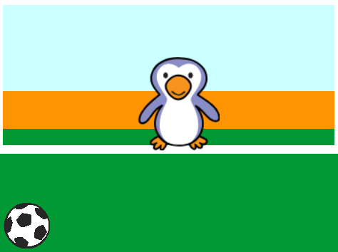

## Μετακίνηση ποδοσφαιριστή

Ας προγραμματίσουμε τη μπάλα να κινείται στο κάτω μέρος της σκηνής.

--- task ---

Άνοιξε το αρχικό έργο Scratch 'Νίκησε τον τερματοφύλακα'.

**Online:** άνοιξε το αρχικό έργο στο [scratch.mit.edu/projects/406767610](https://scratch.mit.edu/projects/406767610){:target="_blank"}.

Αν έχεις λογαριασμό Scratch μπορείς να κάνεις ένα αντίγραφο, κάνοντας κλικ στο κουμπί **Ανάμειξη**.

**Offline**: άνοιξε το [αρχικό έργο](https://rpf.io/p/el-GR/beat-the-goalie-go){:target="_blank"} στον επεξεργαστή εκτός σύνδεσης.

Αν χρειαστεί να κατεβάσεις και να εγκαταστήσεις τον offline editor για το Scratch, μπορείς να το βρεις στο [rpf.io/scratchoff](https://rpf.io/scratchoff){:target="_blank"}.

Στο αρχικό έργο, θα πρέπει να δεις ένα τέρμα στο υπόβαθρο, μια μπάλα και έναν τερματοφύλακα.



--- /task ---

--- task ---

Κάνε κλικ στο αντικείμενο της μπάλας. Πρόσθεσε αυτόν τον κώδικα, έτσι ώστε η μπάλα να κινείται κατά μήκος του κάτω μέρους της οθόνης μέχρι να πατηθεί το πλήκτρο διαστήματος (space).


```blocks3
when green flag clicked
repeat until <key (space v) pressed?>
move (10) steps
if on edge, bounce
end
```

--- /task ---

--- task ---

Κάνε κλικ στην πράσινη σημαία για να δοκιμάσεις το έργο σου. Η μπάλα θα πρέπει να πηγαινοέρχεται στο κάτω μέρος της οθόνης μέχρι να πατηθεί το πλήκτρο διαστήματος.


--- /task ---

--- task ---

Βάλε αυτές τις εντολές στη μπάλα σου, έτσι ώστε να κινείται προς το στόχο μετά το πάτημα του space.


```blocks3
when green flag clicked
repeat until <key (space v) pressed?>
move (10) steps
if on edge, bounce
end
+ repeat (15)
change y by (10)
end
```

--- /task ---

--- task ---

Κάνε κλικ στην πράσινη σημαία για να δοκιμάσεις τον κώδικά /το παιχνίδι σου. Αυτή τη φορά, πάτησε το space και η μπάλα σου πρέπει να κινηθεί προς το στόχο.


--- /task ---

--- task ---

Κάνε κλικ στην πράσινη σημαία για να δοκιμάσεις τον κώδικα. Τι θα συμβεί αν κάνεις κλικ στη σημαία για δεύτερη φορά; Μπορείς να διορθώσεις αυτό το πρόβλημα;

--- hints ---


--- hint ---

`Όταν γίνει κλικ στην πράσινη σημαία`{:class="block3events"}, το αντικείμενο μπάλα θα πρέπει να `πάει`{:class="block3motion"} πίσω στην αρχή.

--- /hint ---

--- hint ---

Θα χρειαστείς αυτό το μπλοκ:

```blocks3
go to x:(-200) y:(-140)
```

--- /hint ---

--- hint ---

Ο κώδικάς σου θα πρέπει να μοιάζει κάπως έτσι:


```blocks3
when green flag clicked
+ go to x:(-200) y:(-140)
repeat until <key (space v) pressed?>
move (10) steps
if on edge, bounce
end
repeat (15)
change y by (10)
end
```

--- /hint ---

--- /hints ---

--- /task ---

