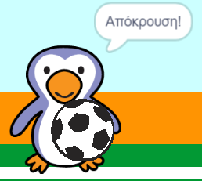

## Ήταν γκολ;

Μόλις η μπάλα φτάσει στο τέρμα, πρέπει να ληφθεί μια απόφαση. __Εάν__ η μπάλα αγγίζει τον τερματοφύλακα τότε έχουμε απόκρουση, __αλλιώς__ έχουμε γκολ.

--- task ---

Πρόσθεσε αυτές τις εντολές στον κώδικα της μπάλας ποδοσφαίρου, ώστε να μπορείς να ελέγχεις αν η μπάλα αγγίζει τον τερματοφύλακα.


```blocks3
repeat (15)
change y by (10)
end
+if <touching (goalie v)> then
else
end
```

--- /task ---

--- task ---

`Παίξε τον ήχο «rattle»`{:class="block3sound"}` εάν ο τερματοφύλακας έχει αποκρούσει την μπάλα`{:class="block3control"}.


```blocks3
if <touching (goalie v)> then
+start sound (rattle v)
else
end
```

--- /task ---

--- task ---

Μπορείς επίσης να μεταδίδεις ένα μήνυμα στον τερματοφύλακα, ώστε να μπορεί να πει 'Απόκρουση'.

Μετάδωσε ένα μήνυμα «απόκρουση» όταν η μπάλα έχει αποκρουστεί.


```blocks3
if <touching (goalie v)> then
start sound (rattle v)
+broadcast (save v)
else
end
```

--- /task ---

--- task ---

Τώρα μπορείς να προγραμματίσεις τον τερματοφύλακα να λέει "Απόκρουση!" όταν λάβει το μήνυμα.


```blocks3
when I receive [save v]
say [Save!] for (1) seconds
```

--- /task ---

--- task ---

Δοκίμασε το πρόγραμμά σου προσπαθώντας να σκοράρεις. Εάν ο τερματοφύλακας σου αποκρούσει την μπάλα, θα πρέπει να πει «Απόκρουση!».



--- /task ---
