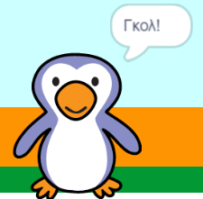

## Γκολ!

--- task ---

Μπορείς να παίξεις έναν ήχο και να προγραμματίσεις τον τερματοφύλακα να λέει "Γκολ!" όταν έχει σημειωθεί ένα γκολ;

Θυμήσου ότι ένα γκολ μετριέται εάν η μπάλα δεν αγγίζει τον τερματοφύλακα.



--- hints ---

--- hint ---

`Εάν η μπάλα δεν`{:class="block3control"}`αγγίζει τον τερματοφύλακα`{:class="block3sensing"} το πρόγραμμά σου θα πρέπει να `παίξει τον ήχο 'cheer'`{:class="block3sound"} και να `μεταδώσει το μήνυμα 'γκολ'`{:class="block3events"}.

`Όταν ο τερματοφύλακας λάβει το μήνυμα 'γκολ'`{:class="block3events"} θα πρέπει να `πει 'Γκολ!'`{:class="block3looks"}.

--- /hint ---

--- hint ---

Θα χρειαστείς αυτά τα μπλοκ:

```blocks3
broadcast (goal v)

say [Goal!] for (1) seconds

when I receive [goal v]

start sound (cheer v)
```

--- /hint ---

--- hint ---

Ο κώδικάς σου θα πρέπει να μοιάζει κάπως έτσι:


```blocks3
if <touching (goalie v)> then
start sound (rattle v)
broadcast (save v)
else
+ start sound (cheer v)
+ broadcast (goal v)
end
```


```blocks3
when I receive [goal v]
say [Goal!] for (1) seconds
```

--- /hint ---


--- /hints ---


--- /task ---
