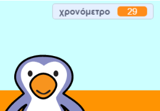

## Προσθήκη χρονομέτρου

Ας προσθέσουμε ένα χρονόμετρο, έτσι ώστε ο παίκτης να πρέπει να σκοράρει όσο περισσότερα γκολ μπορεί σε 30 δευτερόλεπτα.

--- task ---

Δημιούργησε μία νέα `μεταβλητή`{:class="block3variables"} με το όνομα `χρονόμετρο`{:class="block3variables"}.

[[[generic-scratch3-add-variable]]]

--- /task ---

--- task ---

Κάνε κλικ στη __σκηνή__ και πρόσθεσε αυτόν τον κώδικα για να ορίσεις το `χρονόμετρο`{:class="block3variables"} σε 30 στην αρχή του παιχνιδιού.


```blocks3
when green flag clicked
set [timer v] to [30]
```

--- /task ---

--- task ---

Στη συνέχεια, θα πρέπει να προσθέσεις έναν βρόχο `επανάλαβε ώσπου`{:class="block3control"}, έτσι ώστε το χρονόμετρο να μπορεί να τρέξει μέχρι να φτάσει στο 0.


```blocks3
when green flag clicked
set [timer v] to [30]
+repeat until <(timer :: variables) = [0]>
end
```

--- /task ---

--- task ---

Μείωσε το χρονόμετρο κατά 1 κάθε δευτερόλεπτο, έως ότου φτάσει στο 0.


```blocks3
when green flag clicked
set [timer v] to [30]
repeat until <(timer :: variables) = [0]>
+wait (1) seconds
+change [timer v] by (-1)
end
```

--- /task ---

--- task ---

Μόλις το χρονόμετρο φτάσει στο 0, θα πρέπει να `παίξει τον ήχο «whistle»`{:class="block3sound"} και στη συνέχεια να σταματήσει το παιχνίδι.


```blocks3
when green flag clicked
set [timer v] to [30]
repeat until <(timer :: variables) = [0]>
wait (1) seconds
change [timer v] by (-1)
end
+play sound (whistle v) until done
+stop [all v]
```

--- /task ---

--- task ---

Κάνε κλικ στην πράσινη σημαία για να δοκιμάσεις τον κώδικα. Το χρονόμετρο σου θα πρέπει να ξεκινά στο 30 και να τελειώνει στο 0.



Μπορείς να αλλάξεις το χρονόμετρο για να ξεκινάει στο 10, εάν δεν θέλεις να περιμένεις για 30 δευτερόλεπτα!

--- /task ---

--- task ---

Έχεις την ευκαιρία να σκοράρεις 1 γκολ! Για να έχεις περισσότερες από 1 ευκαιρίες, βάλε έναν βρόχο `για πάντα`{:class="block3control"} στον κώδικα της __μπάλας__. Μπορείς επίσης να προσθέσεις μια αναμονή `περίμενε`{:class="block3control"} μεταξύ των προσπαθειών.


```blocks3
when green flag clicked
+forever
    go to x:(-200) y:(-140)
    repeat until <key (space v) pressed?>
        move (10) steps
        if on edge, bounce
    end
    repeat (15)
        change y by (10)
    end
    if <touching (goalie v)> then
        start sound (rattle v)
        broadcast (save v)
    else
        start sound (cheer v)
        broadcast (goal v)
    end
end
```

--- /task ---

