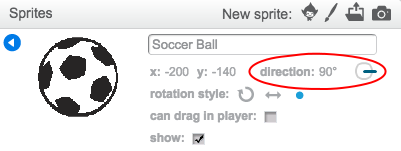

## Introduction

In this project you'll learn how to create a football game in which you have to score as many goals as you can in 30 seconds.

  <iframe allowtransparency="true" width="485" height="402" src="https://scratch.mit.edu/projects/embed/57437924/?autostart=false" frameborder="0"></iframe>
  

### Additional information for club leaders

If you need to print this project, please use the [Printer friendly version](https://projects.raspberry-pi.org/en/projects/beat-the-goalie).

--- collapse ---
---
title: Club leader notes
---

## Introduction:
In this project, children will learn how to create a football game in which the player has to score as many goals as they can in 30 seconds.

## Resources
For this project, Scratch 2 should be used. Scratch 2 can either be used online at [jumpto.cc/scratch-on](http://jumpto.cc/scratch-on) or can be downloaded from [jumpto.cc/scratch-off](http://jumpto.cc/scratch-off) and used offline.

The 'Project Materials' link for this project contains the following resources:

##### Club leader Resources

You can find a completed version of this project <a href="http://scratch.mit.edu/projects/57437924/#editor">online</a>, or it can be downloaded by clicking the 'Project Materials' link for this project, which contains:

+ BeatTheGoalie.sb2

##### Project Resources

For this project, club members can make use of a Scratch project containing the required resources. This project is available at [jumpto.cc/goalie-resources](http://jumpto.cc/goalie-resources), or it can be downloaded by clicking the 'Project Materials' link for this project, which contains:

+ BeatTheGoalieResources.sb2

Make sure that each child has access to a copy of these resources.

## Learning Objectives
+ Events;
+ Sequecing;
+ Repetition;
+ Decisions;
+ Broadcasting;
+ Variables.

This project covers elements from the following strands of the [Raspberry Pi Digital Making Curriculum](http://rpf.io/curriculum):

+ [Combine programming constructs to solve a problem.](https://www.raspberrypi.org/curriculum/programming/builder)

## Challenges
+ "Goal!" - Creating a broadcast message for when a goal is scored;
+ "Adding a score" - Creating and using a `score`{:class="blockdata"} variable;
+ "More controls" - Adding code to control the goalie;
+ "Manual control" - Adding keyboard controls for the football.

## Frequently Asked Questions
+ If the football's direction has been changed, it may bounce around the screen instead of just moving left and right. This can be fixed by setting the direction in the sprite properties, or by adding a `point in direction`{:class="blockmotion"} block to the start of the football's code.

	

--- /collapse ---

--- collapse ---
---
title: Project materials
---
## Project resources
* [Online Scratch 2 project containing external resources](http://jumpto.cc/goalie-resources)
* [Downloadable Scratch 2 project containing external resources](resources/BeatTheGoalieResources.sb2)

## Club leader resources
* [Downloadable completed Scratch 2 project](resources/BeatTheGoalie.sb2)
* [Online completed Scratch 2 project](http://scratch.mit.edu/projects/57437924/#editor)

--- /collapse ---