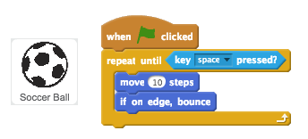
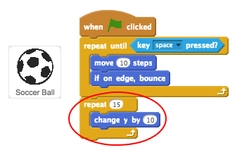

## Moving the football

Let's code the ball to move across the bottom of the stage.


+ Open the 'Beat the Goalie' Scratch project. Your club leader will give you a copy of this project, or you can open it online at <a href="http://jumpto.cc/goalie-resources" target="_blank">jumpto.cc/goalie-resources</a>.

+ Click on your football sprite. Add this code, so that the football moves along the bottom of the screen until the space bar is pressed.

	

+ Click the green flag to test your project. Your football should bounce along the bottom of the screen until the space bar is pressed.

	

+ Add this code to your football sprite, so that the football moves towards the goal after the space bar has been pressed.

	

+ Click the green flag to test your code. This time, press the space bar and your football should move towards the goal.

	

+ Click the green flag to test your code. What happens if you click the flag a second time? Can you use this block to fix the problem?

	```blocks
		go to x:(-180) y:(-140)
	```


