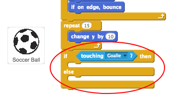
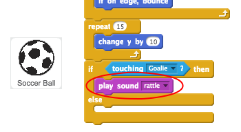
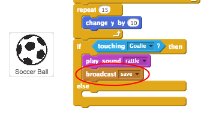
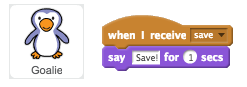

## Was it a goal?

Once the ball has reached the goal, there's a decision to make. __If__ the ball is touching the goalie then it has been saved, __else__ it's a goal.

+ Add this code to the end of your football sprite code, so that you can check whether the ball is touching the goalie.

	

+ Play the 'rattle' sound __if the goalie has saved the ball__.

	

+ You can also broadcast a message to the goalie, so that they can tell you that the ball has been saved.

	Broadcast a 'save' message when the ball has been saved.

	

+ You can now code your goalie to say 'Save!' when they receive the message.

	

+ Test your code by trying to score a goal. If your goalie saves the goal they should say 'Save!'.

	

