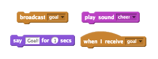

--- challenge ---
## Challenge: goal!
Can you play a sound and code your goalie to say 'Goal!' when a goal has been scored?

Remember that a goal has been scored if the ball is not touching the goalie.

Here are some code blocks you'll need:

--- /challenge ---
