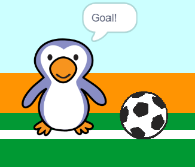

## Goal!

--- task ---

Can you play a sound and code your goalie to say 'Goal!' when a goal has been scored?

Remember that a goal has been scored if the ball is not touching the goalie.



--- hints ---
--- hint ---

Your code should look like this:


```blocks3
if <touching (goalie v)> then
start sound (rattle v)
broadcast (save v)
else
+ start sound (cheer v)
+ broadcast (goal v)
end
```


```blocks3
when I receive [goal v]
say [Goal!] for (1) seconds
```

--- /hint ---
--- /hints ---


--- /task ---
