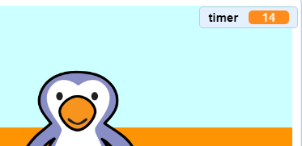

## Adding a timer

Let's add a timer, so that the player has to score as many goals as they can in 30 seconds.

+ First, you'll need to click `Data`{:class="blockdata"}, then click 'Make a Variable' and create a new variable called `timer`{:class="blockdata"}.

	

+ You should now see your new variable on the stage. You should also see some new variable blocks that you'll use to make your timer.

	

+ Click on your __stage__, and add this code to set the `timer`{:class="blockdata"} to 30 at the start of the game.

	

+ Next, you'll need to add a `repeat until`{:class="blockcontrol"} block, so that the timer can run until it gets to 0.

	

+ Reduce your timer by 1 every second until it reaches 0.

	

+ Once the timer has reached 0, you should play the 'whistle' sound and then stop the game.

	

+ Click the green flag to test your code. Your timer should start at 30, and end at 0.

	

	You can change your timer to start at 10 if you don't want to wait for 30 seconds!

+ You only have the chance to score 1 goal! To have more than 1 chance, add a `forever`{:class="blockcontrol"} block around your __football__ sprite. You can also add a `wait`{:class="blockcontrol"} block between attempts.

	

