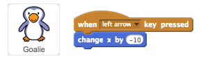
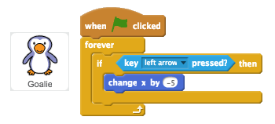

## Control the goalie

It's far too easy to score a goal! Let's allow a second player to try and save goals.

+ Click on your __Goalie__ sprite and add this code to change the goalie's x position when the left arrow is pressed.

	

+ Press the left arrow to test your new code. Your goalie should move to the left.

	

+ Have you noticed that your goalie doesn't move very smoothly? If you want smoother movement, you can use this code __instead of the code you just added__.

	

+ Test your code again, this time by __clicking the green flag and then holding the left arrow key__. Does your goalie move more smoothly?

