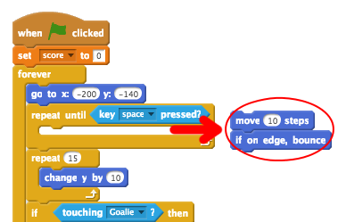
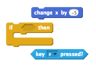

--- challenge ---
## Challenge: Manual control
Instead of the ball moving left and right automatically, can you allow your player to control the ball with the `a` and `d` keys?

To do this you'll need to remove the code for moving the ball left and right.

You can then add code to move the ball when the keys are pressed. Here are some code blocks to help you:

--- /challenge ---