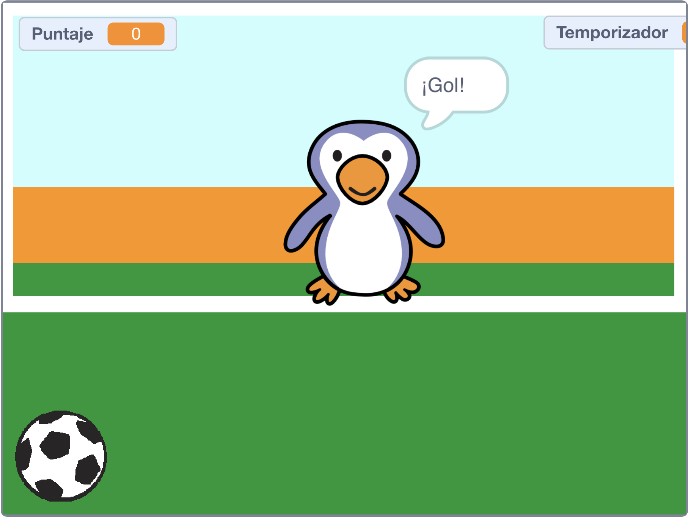

--- no-print ---

Esta es la versión **Scratch 3** del proyecto. También hay una [versión del proyecto en Scratch 2](https://projects.raspberrypi.org/es-LA/projects/beat-the-goalie-scratch2).

--- /no-print ---

## Introducción

En este proyecto aprenderás cómo crear un juego de fútbol de 2 jugadores en el que tendrás que anotar tantos goles como puedas en 30 segundos.

### Lo que harás

--- no-print ---

Haz clic en la bandera verde para empezar. Usa las teclas de flecha izquierda y derecha para controlar al arquero y pulsa <kbd>espacio</kbd> para patear la pelota.

  <iframe allowtransparency="true" width="485" height="402" src="https://scratch.mit.edu/projects/embed/406204960/?autostart=false" frameborder="0" scrolling="no"></iframe>

--- /no-print ---

--- print-only ---

--- /print-only ---

--- collapse ---
---
title: Lo que vas a aprender
---

- Recuerda cómo usar código para responder a pulsaciones de teclas
- Usa bloques de detección para detectar cuando los objetos se tocan entre sí
- Usar bloques de mensaje para comunicarse entre objetos

--- /collapse ---

--- collapse ---
---
title: Lo que necesitarás
---

#### Equipo

+ Una computadora capaz de ejecutar Scratch 3Run

#### Programas

+ Scratch 3 (ya sea [con Internet](http://rpf.io/scratchon){:target="_blank"} o [sin Internet](http://rpf.io/scratchoff){:target="_blank"})

#### Descargas

El proyecto de iniciación puede encontrarse [aquí](http://rpf.io/p/es-LA/beat-the-goalie-go){:target="_blank"}.

--- /collapse ---

--- collapse ---
---
title: Información adicional para educadores
---

--- no-print ---

Si necesitas imprimir este proyecto, por favor utiliza la [versión para imprimir](https://projects.raspberrypi.org/es-LA/projects/beat-the-goalie/print){:target="_blank"}.

--- /no-print ---

Puedes encontrar el [proyecto completo aquí](http://rpf.io/p/es-LA/beat-the-goalie-get){:target="_blank"}.

--- /collapse ---
