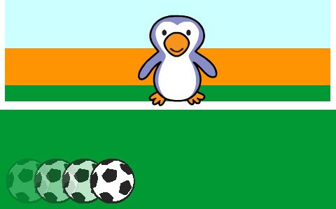

## Moviendo la pelota de fútbol

Hagamos un código para que la pelota se mueva a través de la parte inferior del escenario.

--- task ---

Abre el proyecto de iniciación de Scratch 'Gánale al Arquero'.

**En línea**: abre el proyecto de iniciación en [scratch.mit.edu/projects/406202258](https://scratch.mit.edu/projects/406202258){:target="_blank"}.

Si tienes una cuenta Scratch puedes hacer una copia al hacer clic en **Remix**.

**Sin conexión**: abre el [proyecto de iniciación](http://rpf.io/p/es-LA/beat-the-goalie-go){:target=_blank"} en el editor sin conexión.

Si necesitas descargar e instalar el editor sin conexión de Scratch, puedes encontrarlo en [rpf.io/scratchoff](http://rpf.io/scratchoff){:target="_blank"}.

En el proyecto de iniciación, deberías ver un escenario de portería, un objeto pelota de fútbol y uno de arquero.


--- /task ---

--- task ---

Haz clic en tu objeto pelota de fútbol. Añade este código, para que la pelota de fútbol se desplace a lo largo la parte inferior de la pantalla hasta que se presione la barra espaciadora.


```blocks3
when green flag clicked
repeat until <key (space v) pressed?>
move (10) steps
if on edge, bounce
end
```

--- /task ---

--- task ---

Haz clic en la bandera verde para poner a prueba tu juego. Tu pelota de fútbol debe rebotar en la parte inferior de la pantalla hasta que se presione la barra espaciadora.



--- /task ---

--- task ---

Añade este código a tu objeto pelota de fútbol, para que la pelota de fútbol avance hacia la portería después de que la barra espaciadora haya sido presionada.


```blocks3
when green flag clicked
repeat until <key (space v) pressed?>
move (10) steps
if on edge, bounce
end
+ repeat (15)
change y by (10)
end
```

--- /task ---

--- task ---

Haz clic en la bandera verde para poner a prueba tu código. Esta vez, presiona la barra espaciadora y tu pelota de fútbol debe moverse hacia la portería.


--- /task ---

--- task ---

Haz clic en la bandera verde para poner a prueba tu código. ¿Qué pasa si haces clic en la bandera verde por segunda vez? ¿Puedes solucionar el problema?

--- hints ---


--- hint ---

Después de que la `bandera verde es pulsada`{:class="block3events"} el objeto tendrá que `ir a`{:class="block3motion"} de vuelta al inicio.

--- /hint ---

--- hint ---

Necesitarás este bloque:

```blocks3
go to x:(-200) y:(-140)
```

--- /hint ---

--- hint ---

Tu código debería verse así:


```blocks3
when green flag clicked
+ go to x:(-200) y:(-140)
repeat until <key (space v) pressed?>
move (10) steps
if on edge, bounce
end
repeat (15)
change y by (10)
end
```

--- /hint ---

--- /hints ---

--- /task ---

