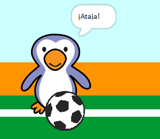

## ¿Fue un gol?

Una vez que la pelota ha alcanzado la portería, hay que tomar una decisión. __Si es que__ la pelota está tocando al arquero entonces ésta ha sido atajada, __de otro modo__ es un gol.

--- task ---

Agrega este código al final de tu código del objeto pelota de fútbol, para que así puedas verificar si la pelota está tocando al arquero.


```blocks3
repeat (15)
change y by (10)
end
+if <touching (goalie v)> then
else
end
```

--- /task ---

--- task ---

` Comenzar el sonido 'sonajero' ` {: class = "block3sound"} ` si el arquero ha salvado la pelota ` {: class = "block3control"}.


```blocks3
if <touching (goalie v)> then
+start sound (rattle v)
else
end
```

--- /task ---

--- task ---

También puedes transmitir un mensaje al arquero, para que puedan decirte que la pelota ha sido atajada.

Transmite un mensaje de "atajar" cuando la pelota ha sido atajada.


```blocks3
if <touching (goalie v)> then
start sound (rattle v)
+broadcast (save v)
else
end
```

--- /task ---

--- task ---

Ahora puedes codificar a tu portero para que diga "¡Atajar!" cuando reciben el mensaje.


```blocks3
when I receive [save v]
say [Save!] for (1) seconds
```

--- /task ---

--- task ---

Prueba tu código tratando de anotar un gol. Si su portero ataja la pelota, debería decir "¡Atajar!".



--- /task ---
