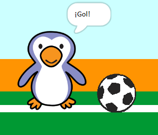

## ¡Gol!

--- task ---

¿Puedes reproducir un sonido y codificar a tu portero para que diga '¡Gol!' cuando se ha anotado un gol?

Recuerda que un gol ha sido anotado si la pelota no está tocando al arquero.



--- hints ---

--- hint ---

`Si la pelota de fútbol no está`{:class="block3control"} `tocando al arquero`{:class="block3sensing"} tu programa debería `iniciar el sonido de aclamación`{:class="block3sound"} y `transmitir un mensaje de gol`{:class="block3events"}.

`Cuando el arquero recibe el mensaje de gol`{:class="block3events"} debería `decir gol`{:class="block3looks"}.

--- /hint ---

--- hint ---

Necesitarás estos bloques:

```blocks3
broadcast (goal v)

say [Goal!] for (1) seconds

when I receive [goal v]

start sound (cheer v)
```

--- /hint ---

--- hint ---

Tu código debería verse así:


```blocks3
if <touching (goalie v)> then
start sound (rattle v)
broadcast (save v)
else
+ start sound (cheer v)
+ broadcast (goal v)
end
```


```blocks3
when I receive [goal v]
say [Goal!] for (1) seconds
```

--- /hint ---


--- /hints ---


--- /task ---
