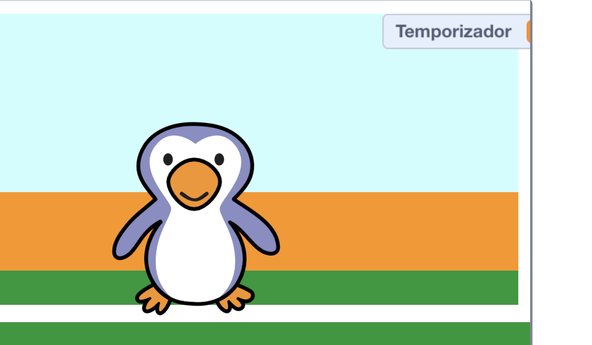

## Añadiendo un temporizador

Agreguemos un temporizador para que el jugador tenga que anotar tantos goles como pueda en 30 segundos.

--- task ---

`Crear una nueva variable`{:class="block3variables"} llamada `temporizador`{:class="block3variables"}.

[[[generic-scratch3-add-variable]]]

--- /task ---

--- task ---

Haz clic en tu __escenario__, y añade este código para establecer el `temporizador`{:class="block3variables"} a 30 al comienzo del juego.


```blocks3
when green flag clicked
set [temporizador v] to [30]
```

--- /task ---

--- task ---

A continuación, tendrás que añadir un bloque `repetir hasta`{:class="block3control"}, para que el temporizador pueda correr hasta llegar a 0.


```blocks3
when green flag clicked
set [temporizador v] to [30]
+repeat until <(temporizador :: variables) = [0]>
end
```

--- /task ---

--- task ---

Reduce tu temporizador en 1 cada segundo hasta que alcance 0.


```blocks3
when green flag clicked
set [temporizador v] to [30]
repeat until <(temporizador :: variables) = [0]>
+wait (1) seconds
+change [temporizador v] by (-1)
end
```

--- /task ---

--- task ---

Una vez que el temporizador ha alcanzado 0, deberías `reproducir el sonido 'whistle'`{:class="block3sound"} y luego detener el juego.


```blocks3
when green flag clicked
set [temporizador v] to [30]
repeat until <(temporizador :: variables) = [0]>
wait (1) seconds
change [temporizador v] by (-1)
end
+play sound (whistle v) until done
+stop [all v]
```

--- /task ---

--- task ---

Haz clic en la bandera verde para probar tu código. Tu temporizador debe comenzar en 30 y terminar en 0.



¡Puedes cambiar tu temporizador para empezar en 10 si no quieres esperar 30 segundos!

--- /task ---

--- task ---

¡Sólo tienes la oportunidad de marcar 1 gol! Para tener más de 1 oportunidad, añade un bloque `para siempre`{:class="block3control"} alrededor de tu código __pelota de futbol__. También puedes añadir un bloque `esperar`{:class="block3control"} entre intentos.


```blocks3
when green flag clicked
+forever
    go to x:(-200) y:(-140)
    repeat until <key (space v) pressed?>
        move (10) steps
        if on edge, bounce
    end
    repeat (15)
        change y by (10)
    end
    if <touching (arquero v)> then
        start sound (rattle v)
        broadcast (atajar v)
    else
        start sound (cheer v)
        broadcast (gol v)
    end
end
```

--- /task ---

