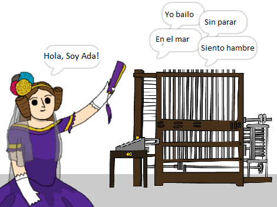

## ¿Qué sigue?

Echa un vistazo al proyecto de Scratch [Generador de Poesía de Ada](https://projects.raspberrypi.org/es-LA/projects/poetry-generator).

--- no-print ---

  <iframe allowtransparency="true" width="485" height="402" src="https://scratch.mit.edu/projects/embed/382936476/?autostart=false" frameborder="0" scrolling="no"></iframe>
  

--- /no-print ---

--- print-only ---

--- /print-only ---

***
Este proyecto fue traducido por voluntarios:

Carolina Lopez

Margarita Quiroz-Cariga (Fitzpatrick)

Gracias a los voluntarios, podemos dar a las personas de todo el mundo la oportunidad de aprender en su propio idioma. Puedes ayudarnos a llegar a más personas ofreciéndote como voluntario para traducir. Más información en [rpf.io/translate](https://rpf.io/translate).