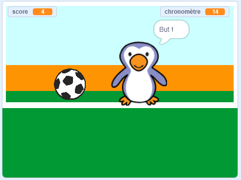

--- no-print ---

Ceci est la version **Scratch 3** du projet. Il existe également une version [Scratch 2 du projet](https://projects.raspberrypi.org/fr-FR/projects/beat-the-goalie-scratch2).

--- /no-print ---

## Introduction

Dans ce projet, tu apprendras à créer un jeu de football à 2 joueurs dans lequel tu devras marquer autant de buts que possible en 30 secondes.

### Ce que tu feras

--- no-print ---

Clique sur le drapeau vert pour commencer. Utilise les touches fléchées gauche et droite pour contrôler le gardien de but et appuie sur <kbd>espace</kbd> pour frapper dans le ballon.

  <iframe allowtransparency="true" width="485" height="402" src="https://scratch.mit.edu/projects/embed/406207673/?autostart=false" frameborder="0" scrolling="no"></iframe>

--- /no-print ---

--- print-only ---

--- /print-only ---

--- collapse ---
---
title: Ce que tu vas apprendre
---

- Se rappeler comment utiliser du code pour répondre aux pressions sur les touches
- Utiliser des blocs de détection pour détecter lorsque les sprites se touchent
- Utiliser des blocs de diffusion pour communiquer entre les sprites

--- /collapse ---

--- collapse ---
---
title: Ce que tu auras besoin
---

#### Matériel informatique

+ Un ordinateur capable d'exécuter Scratch 3

#### Logiciel

+ Scratch 3 (soit [en ligne](http://rpf.io/scratchon){:target="_blank"} soit [hors-ligne](http://rpf.io/scratchoff){:target="_blank"})

#### Téléchargements

Le projet de démarrage peut être trouvé [ici](http://rpf.io/p/fr-FR/beat-the-goalie-go){:target="_blank"}.

--- /collapse ---

--- collapse ---
---
title: Informations supplémentaires pour les éducateurs
---

--- no-print ---

Si vous avez besoin d'imprimer ce projet, merci d'utiliser la [version imprimable](https://projects.raspberrypi.org/fr-FR/projects/beat-the-goalie/print){:target="_blank"}.

--- /no-print ---

Vous pouvez trouver le [projet terminé ici](http://rpf.io/p/fr-FR/beat-the-goalie-get){:target="_blank"}.

--- /collapse ---
