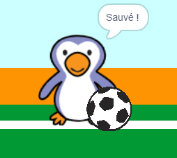

## C'est but ?

Une fois que le ballon a atteint le but, il y a une décision à prendre. __Si__ le ballon touche le gardien de but alors il a été sauvé, __sinon__ c'est but.

--- task ---

Ajoute ce code à la fin de ton code de sprite de ballon de foot, afin que tu puisses vérifier si la balle touche le gardien.


```blocks3
repeat (15)
change y by (10)
end
+if <touching (goalie v)> then
else
end
```

--- /task ---

--- task ---

`Démarre le son « cliquetis » `{:class="block3sound"} `si le gardien a sauvé la balle`{:class="block3control"}.


```blocks3
if <touching (goalie v)> then
+start sound (rattle v)
else
end
```

--- /task ---

--- task ---

Tu peux également diffuser un message au gardien, afin qu'ils puissent te dire que la balle a été sauvée.

Diffuser un message « sauvé » lorsque la balle a été sauvée.


```blocks3
if <touching (goalie v)> then
start sound (rattle v)
+broadcast (save v)
else
end
```

--- /task ---

--- task ---

Tu peux maintenant coder ton gardien de but pour dire « Sauvé ! » quand il reçoit le message.


```blocks3
when I receive [save v]
say [Save!] for (1) seconds
```

--- /task ---

--- task ---

Teste ton code en essayant de marquer un but. Si ton gardien a sauvé son but, il devrait dire « Sauvé ! ».



--- /task ---
