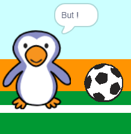

## But !

--- task ---

Peux-tu jouer un son et coder ton gardien pour dire « But ! » quand un but a été marqué ?

Rappelle-toi qu'un but a été marqué si le ballon ne touche pas le gardien.



--- hints ---

--- hint ---

`Si la balle de foot ne`{:class="block3control"} `touche pas le gardien`{:class="block3sensing"} ton programme devrait `commencer le son d'applaudissements`{:class="block3sound"} et `diffuser un message de but`{:class="block3events"}.

`Quand le gardien reçoit le message but`{:class="block3events"} il devrait `dire but`{:class="block3looks"}.

--- /hint ---

--- hint ---

Tu auras besoin de ces blocs :

```blocks3
broadcast (goal v)

say [Goal!] for (1) seconds

when I receive [goal v]

start sound (cheer v)
```

--- /hint ---

--- hint ---

Ton code devrait ressembler à ceci :


```blocks3
if <touching (goalie v)> then
start sound (rattle v)
broadcast (save v)
else
+ start sound (cheer v)
+ broadcast (goal v)
end
```


```blocks3
when I receive [goal v]
say [Goal!] for (1) seconds
```

--- /hint ---


--- /hints ---


--- /task ---
