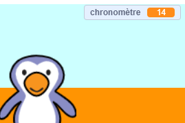

## Ajouter un chronomètre

Ajoutons un chronomètre, pour que le joueur doive marquer autant de buts que possible en 30 secondes.

--- task ---

`Créer une nouvelle variable`{:class="block3variables"} appelée `chronomètre`{:class="block3variables"}.

[[[generic-scratch3-add-variable]]]

--- /task ---

--- task ---

Clique sur ta __scène__, et ajoute ce code pour définir le `chronomètre`{:class="block3variables"} à 30 au début du jeu.


```blocks3
when green flag clicked
set [timer v] to [30]
```

--- /task ---

--- task ---

Ensuite, tu devras ajouter un bloc `répéter jusqu'à`{:class="block3control"}, afin que le chronomètre puisse s'exécuter jusqu'à ce qu'il atteigne 0.


```blocks3
when green flag clicked
set [timer v] to [30]
+repeat until <(timer :: variables) = [0]>
end
```

--- /task ---

--- task ---

Réduis ton chronomètre de 1 seconde jusqu'à ce qu'il atteigne 0.


```blocks3
when green flag clicked
set [timer v] to [30]
repeat until <(timer :: variables) = [0]>
+wait (1) seconds
+change [timer v] by (-1)
end
```

--- /task ---

--- task ---

Une fois que le chronomètre a atteint 0, tu devras `jouer le son « sifflet »`{:class="block3sound"} puis arrêter le jeu.


```blocks3
when green flag clicked
set [timer v] to [30]
repeat until <(timer :: variables) = [0]>
wait (1) seconds
change [timer v] by (-1)
end
+play sound (whistle v) until done
+stop [all v]
```

--- /task ---

--- task ---

Clique sur le drapeau vert pour tester ton code. Ton chronomètre devrait commencer à 30 et se terminer à 0.



Tu peux changer ton chronomètre pour commencer à 10 si tu ne veux pas attendre 30 secondes !

--- /task ---

--- task ---

Tu as seulement la chance de marquer 1 but ! Pour avoir plus de 1 chance, ajoute un bloc `répéter indéfiniment`{:class="block3control"} autour de ton code __balle de foot__. Tu peux également ajouter un bloc `attendre`{:class="block3control"} entre les tentatives.


```blocks3
when green flag clicked
+forever
    go to x:(-200) y:(-140)
    repeat until <key (space v) pressed?>
        move (10) steps
        if on edge, bounce
    end
    repeat (15)
        change y by (10)
    end
    if <touching (goalie v)> then
        start sound (rattle v)
        broadcast (save v)
    else
        start sound (cheer v)
        broadcast (goal v)
    end
end
```

--- /task ---

