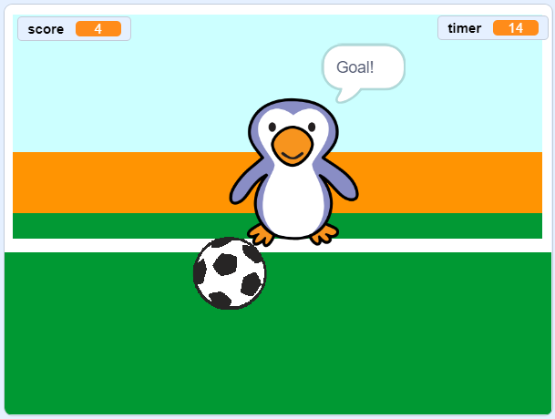

--- no-print ---

यह इस प्रोजेक्ट का **Scratch 3** वर्ज़न (version) है। इस प्रोजेक्ट का[ Scratch 2 वर्ज़न भी है।](https://projects.raspberrypi.org/hi-IN/projects/beat-the-goalie-scratch2)

--- /no-print ---

## परिचय

इस प्रोजेक्ट में आप सीखेंगे कि 2 खिलाड़ी का फुटबॉल गेम कैसे बनाया जाए, जिसमें आपको 30 सेकंड में जीतने के लिए गोल करने हों।

### आप क्या बनायेंगे

--- no-print ---

शुरू करने के लिए हरी झंडी पर क्लिक करें। गोलकीपर को कंट्रोल करने के लिए बाएँ और दाएँ तीर कुंजियों का उपयोग करें और <kbd>space</kbd> का उपयोग गेंद को किक करने के लिए करें।

  <iframe allowtransparency="true" width="485" height="402" src="https://scratch.mit.edu/projects/embed/285942132/?autostart=false" frameborder="0" scrolling="no"></iframe>

--- /no-print ---

--- print-only ---

--- /print-only ---

--- collapse ---
---
title: आप क्या सीखेंगे
---

- की (key) प्रेस का जवाब देने के लिए  याद करें कोड का उपयोग करने का तरीका
- सेन्सिंग ब्लॉक का उपयोग कर के पता लगायें कि स्प्राइट्स एक दूसरे को कब स्पर्श करते हैं
- स्प्राइट्स के बीच संवाद करने के लिए ब्रॉडकास्ट ब्लॉकों का उपयोग करें

--- /collapse ---

--- collapse ---
---
title: आपको क्या जरुरत होगी
---

#### हार्डवेयर

+ कंप्यूटर जिसपे आप  Scratch 3 चला सकते हो I

#### सॉफ्टवेयर

+ स्क्रैच 3 (या तो [ऑनलाइन](http://rpf.io/scratchon){:target="_blank"} या [ऑफलाइन](http://rpf.io/scratchoff){:target="_blank"})

#### डाउनलोड

स्टार्टर प्रोजेक्ट [यहाँ पाया जा सकता है](http://rpf.io/p/hi-IN/beat-the-goalie-go){:target="_blank"}।

--- /collapse ---

--- collapse ---
---
title: शिक्षकों के लिए अतिरिक्त जानकारी
---

--- no-print ---

यदि आपको इस प्रोजेक्ट को प्रिंट करने की जरुरत है, तो कृपया [प्रिंटर-अनुकूल संस्करण](https://projects.raspberrypi.org/hi-IN/projects/beat-the-goalie/print){:target="_blank"} का उपयोग करें। 

--- /no-print ---

आप [पूर्ण प्रोजेक्ट यहां से प्राप्त कर सकते हैं](http://rpf.io/p/hi-IN/beat-the-goalie-get){:target="_blank"}.

--- /collapse ---
