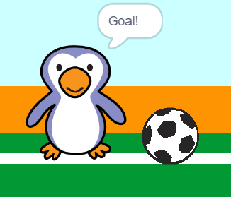

## गोल!

--- task ---

क्या आप एक ध्वनि बजा सकते हैं और 'गोल' कहने के लिए अपने गोलकीपर को कोड कर सकते हैं कि गोल कब किया गया है?

याद रखें कि यदि गेंद गोल को छू नहीं रहा है तो एक गोल किया गया है।



--- hints ---


--- hint ---

`अगर फुटबॉल`{:class="block3control"} `गोलकीपर को नहीं छू रहा है`{:class="block3sensing"} आपके प्रोग्राम को `उत्साही ध्वनि शुरू करनी चाहिए`{:class="block3sound"} और उस संदेश को प्रसारित करें जो कहता है कि `गोल पहुंच गया है`{:class="block3events"}.

`जब गोलकीपर को संदेश मिलता है गोल का`{:class="block3events"} तो उसे `गोल कहना चाहिए`{:class="block3looks"}.

--- /hint ---

--- hint ---

आपको इन ब्लॉकों की जरुरत होगी:

```blocks3
broadcast (goal v)

say [Goal!] for (1) seconds

when I receive [goal v]

start sound (cheer v)
```

--- /hint ---

--- hint ---

आपका कोड इस तरह दिखना चाहिए:


```blocks3
if <touching (goalie v)> then
start sound (rattle v)
broadcast (save v)
else
+ start sound (cheer v)
+ broadcast (goal v)
end
```


```blocks3
when I receive [goal v]
say [Goal!] for (1) seconds
```

--- /hint ---


--- /hints ---


--- /task ---
