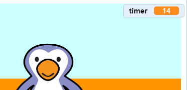

## टाइमर (timer) जोड़ना

चलो एक टाइमर जोड़ते हैं, ताकि खिलाड़ी को 30 सेकंड में जितने गोल हो सकें, स्कोर करना पड़े।

--- task ---

एक नया `variable`{:class="block3variables"} बनाइये जिसका नाम `timer`{:class="block3variables"} होगा ।

[[[generic-scratch3-add-variable]]]

--- /task ---

--- task ---

__stage__ पर क्लिक करें, और इस कोड  `timer`{:class="block3variables"} को जोड़े ताकि टाइमर 30 पर सेट हो जाये ।


```blocks3
when green flag clicked
set [timer v] to [30]
```

--- /task ---

--- task ---

अगला, आपको जोड़ना है `repeat until`{:class="block3control"} ब्लॉक, ताकि टाइमर 0 तक पहुंचने तक चल सके।


```blocks3
when green flag clicked
set [timer v] to [30]
+repeat until <(timer :: variables) = [0]>
end
```

--- /task ---

--- task ---

0 तक पहुंचने तक अपने टाइमर को 1 सेकंड तक कम करें।


```blocks3
when green flag clicked
set [timer v] to [30]
repeat until <(timer :: variables) = [0]>
+wait (1) seconds
+change [timer v] by (-1)
end
```

--- /task ---

--- task ---

एक बार जब टाइमर 0 पर पहुंच गया है, तो आपको `ध्वनि बजानी चाहिए`{:class="block3sound"} और फिर खेल बंद होना चाहिए ।


```blocks3
when green flag clicked
set [timer v] to [30]
repeat until <(timer :: variables) = [0]>
wait (1) seconds
change [timer v] by (-1)
end
+play sound (whistle v) until done
+stop [all v]
```

--- /task ---

--- task ---

अपने कोड का परीक्षण करने के लिए हरे झंडे पर क्लिक करें। आपका टाइमर 30 से शुरू होना चाहिए, और 0 पर समाप्त होना चाहिए।



यदि आप 30 सेकंड के लिए इंतजार नहीं करना चाहते हैं तो आप 10 सेकंड पर शुरू करने के लिए अपना टाइमर बदल सकते हैं!

--- /task ---

--- task ---

आपके पास केवल 1 गोल करने का मौका है! 1 से अधिक मौका देने के लिए, जोड़ें: `forever`{:class="block3control"} कोड और __football__ कोड से अपने चारों ओर ब्लॉक करें । आप एक `wait`{:class="block3control"} ब्लॉक प्रयास के बीच भी जोड़ सकते हैं ।


```blocks3
when green flag clicked
+forever
    go to x:(-200) y:(-140)
    repeat until <key (space v) pressed?>
        move (10) steps
        if on edge, bounce
    end
    repeat (15)
        change y by (10)
    end
    if <touching (goalie v)> then
        start sound (rattle v)
        broadcast (save v)
    else
        start sound (cheer v)
        broadcast (goal v)
    end
end
```

--- /task ---

