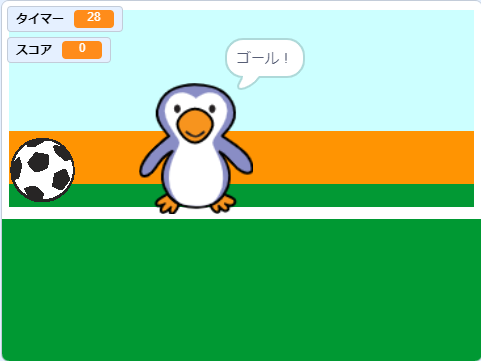

--- no-print ---

これはプロジェクトの**Scratch 3**バージョンです。 [Scratch 2バージョンのプロジェクト](https://projects.raspberrypi.org/ja-JP/projects/beat-the-goalie-scratch2)もあります。

--- /no-print ---

## はじめに

このプロジェクトでは、30秒でできるだけたくさんゴールを決める2人用のサッカーゲームの作り方を学びます。

### 作るもの

--- no-print ---

緑の旗 (はた) をクリックしてスタートします。 左右の矢印 (やじるし) キーを使ってゴールキーパーを動かし、<kbd>スペースキー</kbd>を押して (おして) ボールをけります。

  <iframe allowtransparency="true" width="485" height="402" src="https://scratch.mit.edu/projects/embed/410608702/?autostart=false" frameborder="0" scrolling="no"></iframe>

--- /no-print ---

--- print-only ---

--- /print-only ---

--- collapse ---
---
title: 学ぶこと
---

- キーを押したときに反応 (はんのう) するコードの使い方をおぼえる
- 「調べる」ブロックを使って、スプライト同士がふれたことを検出 (けんしゅつ) する
- 「メッセージ」ブロックを使ったスプライト間の通信の行い方

--- /collapse ---

--- collapse ---
---
title: 必要（ひつよう）なもの
---

#### ハードウェア

+ Scratch 3を実行できるコンピュータ

#### ソフトウェア

+ Scratch 3 ([オンライン](http://rpf.io/scratchon){:target="_blank"}または[オフライン](http://rpf.io/scratchoff){:target="_blank"})

#### ダウンロード

基本 (きほん) のプロジェクトは [こちら](http://rpf.io/p/ja-JP/beat-the-goalie-go){:target="_blank"}にあります。

--- /collapse ---

--- collapse ---
---
title: 教育者向けの追加情報
---

--- no-print ---

このプロジェクトを印刷する必要がある場合は、 [印刷用バージョン](https://projects.raspberrypi.org/ja-JP/projects/beat-the-goalie/print){:target="_blank"}を使用してください。

--- /no-print ---

[完成したプロジェクトはこちら](http://rpf.io/p/ja-JP/beat-the-goalie-get){:target="_blank"}にあります。

--- /collapse ---
