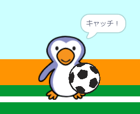

## ゴールできたでしょうか？

ボールがゴールにとうたつしたら、この2つの内、どちらか決めなければなりません。 __もし__ ボールがゴールキーパーに当たっていたなら、ゴールキーパーがシュートをふせいだことになります。__でなければ__、ゴールになります。

--- task ---

このコードをボールのコードのおわりに追加して、ボールがゴールキーパーにふれたかどうかをたしかめられるようにします。


```blocks3
repeat (15)
change y by (10)
end
+if <touching (ゴールキーパー v)> then
else
end
```

--- /task ---

--- task ---

`ゴールキーパーがシュートをふせいだら、`{:class="block3control"}`「ガラガラ」の音を鳴らします`{:class="block3sound"} 。


```blocks3
if <touching (ゴールキーパー v)> then
+start sound (rattle v)
else
end
```

--- /task ---

--- task ---

ゴールキーパーにメッセージを送って、キーパーがシュートをふせいだことを知らせることもできます。

シュートがふせがれたら、「キャッチ」メッセージを送ります。


```blocks3
if <touching (ゴールキーパー v)> then
start sound (rattle v)
+broadcast (キャッチ v)
else
end
```

--- /task ---

--- task ---

これで、ゴールキーパーがメッセージを受け取ったときに「キャッチ！」と言うようにコードを入れることができます。


```blocks3
when I receive [キャッチ v]
say [キャッチ！] for (1) seconds
```

--- /task ---

--- task ---

ボールをシュートしてコードをテストします。 ゴールキーパーがシュートをふせいだ場合、「キャッチ！」と言うはずです。



--- /task ---
