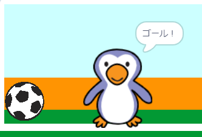

## ゴール！

--- task ---

ゴールしたときに、音を鳴らしてゴールキーパーに「ゴール！」と言わせることができますか？

ボールがゴールキーパーにふれていない場合は、ゴールしたことになることをおぼえておきましょう。



--- hints ---


--- hint ---

`ボールが`{:class="block3control"} `ゴールキーパーにふれて`{:class="block3sensing"}`いなければ、`{:class="block3control"} プログラムは`歓声 (かんせい) の音を鳴らし、 `{:class="block3sound"}`「ゴール」メッセージを送る`{:class="block3events"}必要があります。

`ゴールキーパーが「ゴール」メッセージを受け取ったら、`{:class="block3events"}`「ゴール！」`{:class="block3looks"}と言います。

--- /hint ---

--- hint ---

使うのはこのブロックです。

```blocks3
broadcast (ゴール v)

say [ゴール！] for (1) seconds

when I receive [ゴール v]

start sound (cheer v)
```

--- /hint ---

--- hint ---

コードは次のようになります。


```blocks3
if <touching (ゴールキーパー v)> then
start sound (rattle v)
broadcast (キャッチ v)
else
+ start sound (cheer v)
+ broadcast (ゴール v)
end
```


```blocks3
when I receive [ゴール v]
say [ゴール！] for (1) seconds
```

--- /hint ---


--- /hints ---


--- /task ---
