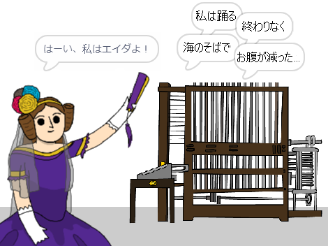

## 次は何をしましょうか？

Scratch プロジェクト [エイダの自動作詩機](https://projects.raspberrypi.org/ja-JP/projects/poetry-generator) (じどうさくしき) を見てみましょう。

--- no-print ---

  <iframe allowtransparency="true" width="485" height="402" src="https://scratch.mit.edu/projects/embed/382847243/?autostart=false" frameborder="0" scrolling="no"></iframe>
  

--- /no-print ---

--- print-only ---

--- /print-only ---

***
このプロジェクトは以下のボランティアによって翻訳されました。

松原慧子

大野 雅利

ボランティアのおかげで、世界中の人々に母国語で学ぶ機会を与えることができます。翻訳を引き受けていただくことで、より多くの人々に手を差し伸べることができます。詳しくは [rpf.io/translate](https://rpf.io/translate) をご覧ください。