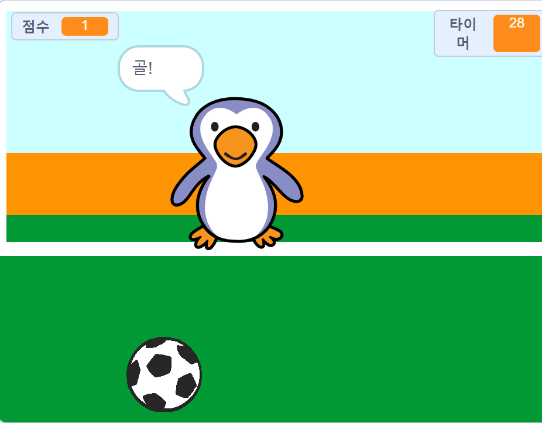

--- no-print ---

이 프로젝트의 **스크래치 3** 버전입니다. [프로젝트의 스크래치 2 버전](https://projects.raspberrypi.org/en/projects/beat-the-goalie-scratch2)도 있습니다.

--- /no-print ---

## 들어가며

이 프로젝트에서는 30초 내에 가능한 한 많은 골을 넣어야 하는 2인용 축구 게임을 만드는 방법에 대해 배우게 됩니다.

### 만들 작품

--- no-print ---

녹색 깃발을 눌러 시작합니다. 왼쪽 및 오른쪽 화살표 키를 사용하여 골키퍼를 제어하고 공을 차기 위해 <kbd>스페이스</kbd>를 누르세요

  <iframe allowtransparency="true" width="485" height="402" src="https://scratch.mit.edu/projects/embed/285942132/?autostart=false" frameborder="0" scrolling="no"></iframe>

--- /no-print ---

--- print-only ---

--- /print-only ---

--- collapse ---
---
title: 이런 것들을 배우게 됩니다.
---

- 코드를 사용하여 키 누름에 응답하는 방법을 상기합니다.
- 감지 블록을 사용하여 스프라이트가 서로 접촉할 때를 감지합니다.
- 브로드캐스트 블록을 사용하여 스프라이트 간 통신을 수행합니다.

--- /collapse ---

--- collapse ---
---
title: 준비물
---

#### 하드웨어

+ 스크래치 3를 실행할 수 있는 컴퓨터

#### 소프트웨어

+ 스크래치 3 ([온라인](http://rpf.io/scratchon) 또는 [오프라인](http://rpf.io/scratchoff))

#### 다운로드

스타터 프로젝트는 [여기](http://rpf.io/p/en/beat-the-goalie-go){:target="_blank"}를 클릭하면 열 수 있습니다.

--- /collapse ---

--- collapse ---
---
title: 교육자를 위한 추가 정보
---

--- no-print ---

이 프로젝트를 인쇄하기 위해서는 [프린트용 버전](https://projects.raspberrypi.org/en/projects/beat-the-goalie/print){:target="_blank"}을 사용해 주십시오.

--- /no-print ---

[여기서](http://rpf.io/p/en/beat-the-goalie-get){:target="_blank"} 완료된 프로젝트를 확인할 수 있습니다.

--- /collapse ---
