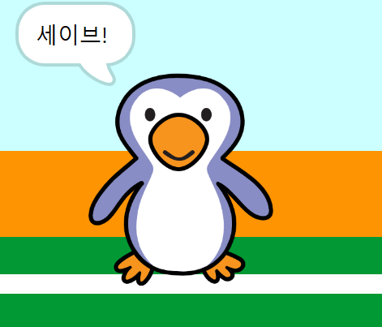

## 골 이었나요?

공이 골대에 도착하면, 결정을 내려야 합니다. __만약__ 공이 골키퍼에 닿으면 세이브가 되고, __아니면__ 골입니다.

--- task ---

이 코드를 축구공 스프라이트 코드의 끝에 추가하면 공이 골키퍼에 닿는지 확인할 수 있습니다.


```blocks3
repeat (15)
change y by (10)
end
+if <touching (goalie v)> then
else
end
```

--- /task ---

--- task ---

`만약 골키퍼가 공을 세이브 한 경우`{:class="block3control"}, `'rattle' 소리 재생하기`{:class="block3sound"}


```blocks3
if <touching (goalie v)> then
+start sound (rattle v)
else
end
```

--- /task ---

--- task ---

또한 골키퍼에게 메시지를 방송하여 볼이 세이브되었음을 알릴 수 있습니다.

공이 세이브 되면 '세이브' 메시지를 방송합니다.


```blocks3
if <touching (goalie v)> then
start sound (rattle v)
+broadcast (save v)
else
end
```

--- /task ---

--- task ---

이제 메시지를 받은 골키퍼가 '세이브!' 라고 말하도록 코딩할 수 있습니다.


```blocks3
when I receive [save v]
say [Save!] for (1) seconds
```

--- /task ---

--- task ---

골을 넣어 코드를 테스트합니다. 골키퍼가 골을 막으면 '세이브!' 라고 말해야 합니다.



--- /task ---
