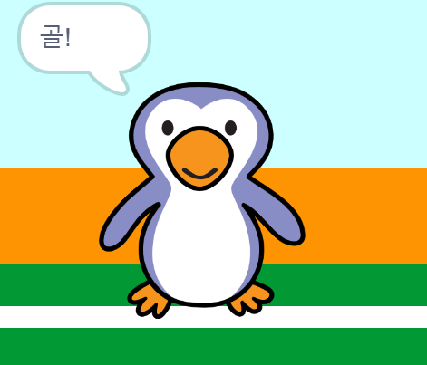

## 골!

--- task ---

골을 넣었을 때 골키퍼가 '골!'이라고 소리내어 말하도록 코드를 작성할 수 있나요?

공이 골키퍼에 닿지 않으면 골을 넣어서 득점했다는 것을 기억하세요.



--- hints ---

--- hint ---

`만약 축구공이`{:class="block3control"} `골키퍼에 닿지 않았다면`{:class="block3sensing"} 프로그램은 `응원 소리 재생`{:class="block3sound"} 과 `골 메시지 방송`{:class="block3events"} 을 할 것입니다.

`골키퍼가 골 메시지를 받으면`{:class="block3events"} `골`{:class="block3looks"} 을 말할 것입니다.

--- /hint ---

--- hint ---

이 블럭들이 필요할겁니다.

```blocks3
broadcast (goal v)

say [Goal!] for (1) seconds

when I receive [goal v]

start sound (cheer v)
```

--- /hint ---

--- hint ---

다음과 같은 코드가 될 것입니다.:


```blocks3
if <touching (goalie v)> then
start sound (rattle v)
broadcast (save v)
else
+ start sound (cheer v)
+ broadcast (goal v)
end
```


```blocks3
when I receive [goal v]
say [Goal!] for (1) seconds
```

--- /hint ---


--- /hints ---


--- /task ---
