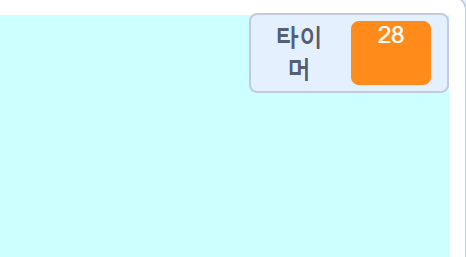

## 타이머 추가하기

30초 안에 최대한 많은 골을 넣도록 타이머를 추가해 보겠습니다.

--- task ---

새로운 `변수`{:class="block3variables"}를 생성하고, `타이머`{:class="block3variables"}라는 이름을 붙이세요.

[[[generic-scratch3-add-variable]]]

--- /task ---

--- task ---

__무대__를 클릭하고, 이 코드를 추가해, `타이머`{:class="block3variables"}를 게임 시작할 때 30으로 설정합니다.


```blocks3
when green flag clicked
set [timer v] to [30]
```

--- /task ---

--- task ---

그런 다음 타이머가 0이 될 때 까지 실행할 수 있도록 `까지 반복`{:class="block3control"} 블록을 추가해야 합니다.


```blocks3
when green flag clicked
set [timer v] to [30]
+repeat until <(timer :: variables) = [0]>
end
```

--- /task ---

--- task ---

타이머가 0이 될 때까지 매초마다 1씩 줄입니다.


```blocks3
when green flag clicked
set [timer v] to [30]
repeat until <(timer :: variables) = [0]>
+wait (1) seconds
+change [timer v] by (-1)
end
```

--- /task ---

--- task ---

타이머가 0에 도달하면, `'휘파람' 소리내기`{:class="block3sound"} 를 실행하고 게임을 중지합니다.


```blocks3
when green flag clicked
set [timer v] to [30]
repeat until <(timer :: variables) = [0]>
wait (1) seconds
change [timer v] by (-1)
end
+play sound (whistle v) until done
+stop [all v]
```

--- /task ---

--- task ---

녹색 깃발을 눌러 코드를 테스트합니다. 타이머는 30에 시작해서 0에 끝나야 합니다.



30초 동안 기다리지 않으려면 10초로 시작하도록 타이머를 변경할 수 있습니다!

--- /task ---

--- task ---

1골을 넣을 단 한번의 기회가 있습니다! 두 번 이상의 기회를 갖기 위해, `무한 반복`{:class="block3control"} 블록을 __축구공__ 코드 근처에 추가하세요. 또한 `기다리기`{:class="block3control"} 블록을 시도 사이에 추가할 수 있습니다.


```blocks3
when green flag clicked
+forever
    go to x:(-200) y:(-140)
    repeat until <key (space v) pressed?>
        move (10) steps
        if on edge, bounce
    end
    repeat (15)
        change y by (10)
    end
    if <touching (goalie v)> then
        start sound (rattle v)
        broadcast (save v)
    else
        start sound (cheer v)
        broadcast (goal v)
    end
end
```

--- /task ---

