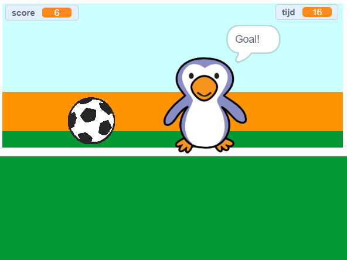

--- no-print ---

Dit is de **Scratch 3** versie van het project. Er is ook een [Scratch 2 versie van dit project](https://projects.raspberrypi.org/nl-NL/projects/beat-the-goalie-scratch2).

--- /no-print ---

## Inleiding

In dit project leer je hoe je een voetbalspel voor 2 spelers maakt waarin je zoveel mogelijk doelpunten moet maken in 30 seconden.

### Wat ga je maken

--- no-print ---

Klik op de groene vlag om te beginnen. Gebruik de linker en rechter pijltjestoetsen om de keeper te besturen en druk op <kbd>spatie</kbd> om de bal te schoppen.

  <iframe allowtransparency="true" width="485" height="402" src="https://scratch.mit.edu/projects/embed/395261569/?autostart=false" frameborder="0" scrolling="no"></iframe>

--- /no-print ---

--- print-only ---

--- /print-only ---

--- collapse ---
---
title: Wat ga je leren
---

- Bedenk hoe je code kunt gebruiken om te reageren op toetsaanslagen
- Gebruik waarnemingsblokken om te detecteren wanneer sprites elkaar raken
- Gebruik signaalblokken om te communiceren tussen sprites

--- /collapse ---

--- collapse ---
---
title: Wat heb je nodig
---

#### Hardware

+ Een computer die Scratch 3 kan uitvoeren

#### Software

+ Scratch 3 ([online](https://rpf.io/scratchon){:target="_blank"} of [offline](https://rpf.io/scratchoff){:target="_blank"})

#### Downloads

Het startproject kan [hier](https://rpf.io/p/nl-NL/beat-the-goalie-go){:target="_blank"} gevonden worden.

--- /collapse ---

--- collapse ---
---
title: Aanvullende informatie voor docenten
---

--- no-print ---

Als je dit project wilt afdrukken, gebruik dan de [printervriendelijke versie ](https://projects.raspberrypi.org/nl-NL/projects/beat-the-goalie/print){:target="_blank"}.

--- /no-print ---

Je kunt het [voltooide project hier](https://rpf.io/p/nl-NL/beat-the-goalie-get){:target="_blank"} vinden.

--- /collapse ---
