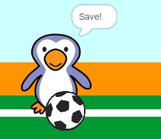

## Was het een doelpunt?

Zodra de bal het doel heeft bereikt, moet er een beslissing worden genomen. __Als__ de bal de keeper raakt, __dan__ is het een redding, <0>anders</0> is het een doelpunt.

--- task ---

Voeg deze code toe aan het einde van je voetbal sprite code, zodat je kunt controleren of de bal de keeper raakt.


```blocks3
herhaal (15)
verander y met (10)
einde
+ als <raak ik (goalie v) ?> dan
anders
einde
```

--- /task ---

--- task ---

`Start het 'rammelaar'-geluid`{:class="block3sound"} `als de keeper de bal heeft tegengehouden`{:class="block3control"}.


```blocks3
als <raak ik (goalie) ?> dan
+ start geluid (rattle v)
anders
einde
```

--- /task ---

--- task ---

Je kunt ook een bericht naar de keeper sturen, zodat deze je kan vertellen dat de bal is tegengehouden.

Verzend een 'save' bericht wanneer de bal is tegengehouden.


```blocks3
als <raak ik (goalie v) ?> dan
start geluid (rattle v)
+ zend signaal (save v)
anders
einde
```

--- /task ---

--- task ---

Je kunt nu je keeper programmeren om 'Save!' te zeggen wanneer het bericht ontvangen wordt.


```blocks3
wanneer ik signaal [save v] ontvang
zeg [Save!] (1) sec.
```

--- /task ---

--- task ---

Test je code door te proberen te scoren. Als je keeper de bal tegenhoudt, moet hij 'Save!' zeggen.



--- /task ---
