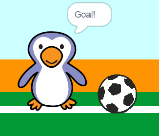

## Goal!

--- task ---

Kun je een geluid laten afspelen en je keeper programmeren om te zeggen 'Goal!' wanneer er gescoord is?

Vergeet niet dat er gescoord is als de bal de keeper niet raakt.



--- hints ---

--- hint ---

`Als de bal niet`{:class="block3control"} `de keeper`{:class="block3sensing"} aanraakt, moet je programma `het gejuich starten`{:class="block3sound"} en `een goal bericht uitzenden`{:class="block3events"}.

`Wanneer de keeper het goal bericht`{:class="block3events"} ontvangt, moet hij `goal zeggen`{:class="block3looks"}.

--- /hint ---

--- hint ---

Je hebt deze blokken nodig:

```blocks3
zend signaal (goal v)

zeg [goal!] (1) sec.

wanneer ik signaal [goal v] ontvang

start geluid (cheer v)
```

--- /hint ---

--- hint ---

Je code zou er als volgt uit moeten zien:


```blocks3
als <raak ik (goalie v) ?> dan
start geluid (rattle v)
zend signaal (save v)
anders
+ start geluid (cheer v)
+ zend signaal (goal v)
einde
```


```blocks3
wanneer ik signaal [goal v] ontvang
zeg [Goal!] (1) sec.
```

--- /hint ---


--- /hints ---


--- /task ---
