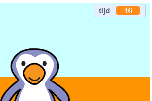

## Een timer toevoegen

Laten we een timer toevoegen, zodat de speler binnen 30 seconden zoveel mogelijk doelpunten moet maken.

--- task ---

`Maak een nieuwe variabele`{:class="block3variables"} genaamd `tijd`{:class="block3variables"}.

[[[generic-scratch3-add-variable]]]

--- /task ---

--- task ---

Klik op je __speelveld__ en voeg deze code toe om de `tijd`{:class="block3variables"} in te stellen op 30 aan het begin van het spel.


```blocks3
wanneer op de groene vlag wordt geklikt
maak [timer v] [30]
```

--- /task ---

--- task ---

Vervolgens moet je een `herhaal tot`{:class="block3control"} blok toevoegen, zodat de timer kan aftellen totdat deze op 0 komt.


```blocks3
wanneer op de groene vlag wordt geklikt
maak [timer v] [30]
+ herhaal tot <(timer :: variables) = [0]>
einde
```

--- /task ---

--- task ---

Laat de timer aftellen 1 seconde totdat deze 0 bereikt.


```blocks3
wanneer op de groene vlag wordt geklikt
maak [timer v] [30]
herhaal tot <(timer :: variables) = [0]>
+ wacht (1) sec.
+ verander [timer v] met (-1)
einde
```

--- /task ---

--- task ---

Zodra de timer 0 heeft bereikt, moet je `het 'fluit'-geluid`{:class="block3sound"} laten afspelen en vervolgens het spel stoppen.


```blocks3
wanneer op de groene vlag wordt geklikt
maak [timer v] [30]
herhaal tot <(timer :: variables) = [0]>
wacht (1) sec.
verander [timer v] met (-1)
einde
+ start geluid (fluit v) en wacht
+ stop [alle v]
```

--- /task ---

--- task ---

Klik op de groene vlag om de code te testen. Je timer moet beginnen op 30 en eindigen op 0.



Je kunt je timer instellen om op 10 te starten als je niet 30 seconden wilt wachten!

--- /task ---

--- task ---

Je hebt slechts de kans om 1 doelpunt te scoren! Om meer dan 1 kans te hebben, voeg een `herhaal`{:class="block3control"} blok aan de __voetbal__ code toe. Je kunt ook een `wacht`{:class="block3control"} blok tussen doelschoten toevoegen.


```blocks3
wanneer op de groene vlag wordt geklikt
+ herhaal
    ga naar x:(- 200) y:(- 140)
    herhaal tot < toets (spatiebalk v) ingedrukt?>
        neem (10) stappen
        keer om aan de rand
    einde
    herhaal (15)
        verander y met ( 10)
    einde
    als <raak ik (goalie v) ?> dan
        start geluid (rattle v)
        zend signaal (save v)
    anders
        start geluid (cheer v)
        zend signaal (goal v)
    einde
einde
```

--- /task ---

